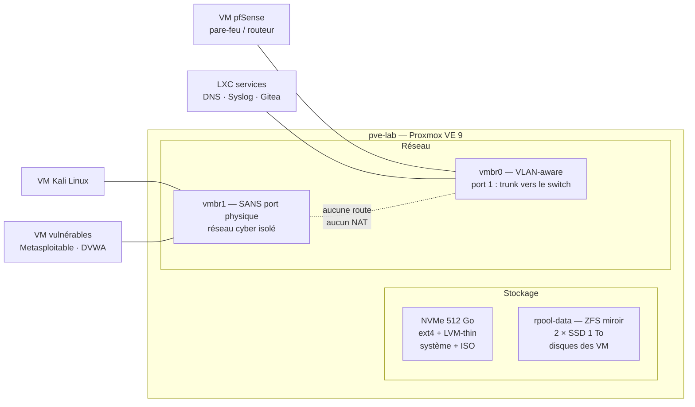

## Pourquoi deux hyperviseurs ?

| | **Proxmox VE** (type 1) | **VirtualBox** (type 2) |
| --- | --- | --- |
| Où | Machine dédiée allumée en permanence | Mon PC portable |
| Pour quoi | Services durables : pare-feu, DNS, Syslog, Git, maquettes d'atelier | Labs jetables, révisions en mobilité, VM fournies en cours (`.ova`) |
| Réseau | Bridges VLAN-aware, pare-feu intégré | NAT, réseau interne, « host-only » |
| Atout | Snapshots ZFS, sauvegardes, API, cloud-init | Portable, aucune infrastructure requise |

Les deux sont complémentaires : je prototype sur VirtualBox, puis je pérennise sur Proxmox
ce qui mérite de l'être (export `.ova` → import avec `qm importovf`).

## Architecture de l'hôte Proxmox



## Stockage : ZFS et LVM-thin

### Choix du ZFS pour les VM

Les disques des VM sont sur un **pool ZFS en miroir** :

```bash
zpool create -o ashift=12 rpool-data mirror \
  /dev/disk/by-id/ata-SSD_1TB_A /dev/disk/by-id/ata-SSD_1TB_B
zfs set compression=lz4 rpool-data        # gain ~30 % sans coût CPU notable
zfs set atime=off rpool-data              # moins d'écritures inutiles
zfs set xattr=sa rpool-data
pvesm add zfspool vm-zfs --pool rpool-data --content images,rootdir --sparse 1
```

| Critère | ZFS miroir | LVM-thin |
| --- | --- | --- |
| Intégrité des données | **Sommes de contrôle** sur chaque bloc, auto-réparation en miroir | Aucune vérification |
| Snapshots | Instantanés, sans impact de performance | Possibles, mais dégradent les performances |
| Consommation mémoire | Élevée (ARC) — je la plafonne | Faible |
| Usage chez moi | Disques des VM | Système, ISO, modèles |

Le cache ARC de ZFS prend par défaut jusqu'à la moitié de la RAM : je le limite à 8 Go
pour laisser la mémoire aux VM.

```bash
echo "options zfs zfs_arc_max=$((8 * 1024**3))" > /etc/modprobe.d/zfs.conf
update-initramfs -u -k all
```

Un **scrub** mensuel vérifie l'intégrité de tous les blocs (tâche fournie par Proxmox
dans `/etc/cron.d/zfsutils-linux`), et j'en surveille le résultat avec `zpool status -x`.

### Sauvegardes (règle 3-2-1)

- **Snapshots ZFS** avant toute manipulation risquée : `qm snapshot 110 avant-maj`.
- **Sauvegardes `vzdump`** planifiées chaque nuit, mode `snapshot`, compression `zstd`, rétention 7 quotidiennes + 4 hebdomadaires.
- **Copie hors machine** hebdomadaire sur un disque USB, déconnecté entre deux sauvegardes (protection contre un rançongiciel).

Une sauvegarde n'existe que si sa restauration a été testée : je restaure une VM au
hasard chaque mois sur un VMID de test.

## Isolation des VM de test cyber

C'est la règle la plus importante de mon homelab : **une VM vulnérable ne doit jamais
pouvoir joindre mon réseau domestique ni Internet**.

### Mise en œuvre

1. **Bridge sans port physique** : `vmbr1` n'a aucune interface réelle — il est physiquement impossible pour une trame d'en sortir.

   ```bash
   # /etc/network/interfaces
   auto vmbr1
   iface vmbr1 inet manual
       bridge-ports none
       bridge-stp off
       bridge-fd 0
   # Remarque : aucune adresse IP sur l'hôte → l'hôte n'est pas joignable depuis ce réseau
   ```

2. **Aucune IP de l'hôte** sur ce bridge : Proxmox lui-même est invisible depuis le lab.
3. **Pare-feu Proxmox activé** sur chaque carte des VM du lab, politique `DROP` en sortie vers toute adresse hors `192.168.66.0/24`.
4. **Pas de dossiers partagés ni de presse-papier** entre VM et hôte (VirtualBox : `Shared Clipboard: Disabled`, `Drag'n'Drop: Disabled`).
5. **Snapshot « propre »** de chaque VM vulnérable, restauré après chaque session.

### Équivalent sous VirtualBox

Sur le portable, les labs utilisent exclusivement le mode **« Réseau interne »**
(`intnet-cyber`) : les VM communiquent entre elles, sans NAT ni accès à l'hôte. Un serveur
DHCP interne est déclaré pour ce réseau :

```bash
VBoxManage dhcpserver add --network=intnet-cyber \
  --server-ip=192.168.66.1 --netmask=255.255.255.0 \
  --lower-ip=192.168.66.100 --upper-ip=192.168.66.200 --enable
VBoxManage modifyvm "Kali-Lab" --nic1 intnet --intnet1 intnet-cyber
VBoxManage modifyvm "Kali-Lab" --clipboard-mode disabled --drag-and-drop disabled
```

### Vérification de l'isolation

Depuis la VM Kali, avant chaque nouvelle série d'exercices :

```bash
ping -c 2 -W 1 1.1.1.1          # doit échouer : pas d'Internet
ping -c 2 -W 1 192.168.1.254    # doit échouer : pas de réseau domestique
ip route                        # une seule route : 192.168.66.0/24
```

## Ce que ce homelab m'apporte

- Un terrain où **casser sans conséquence** : chaque configuration de mes projets E4/E5 y a été testée d'abord.
- Une compréhension concrète du stockage (intégrité, snapshots, sauvegardes) que l'on ne voit pas sur une maquette de TP éphémère.
- Des réflexes de sécurité : isolation par conception, principe de moindre privilège appliqué même chez soi.
