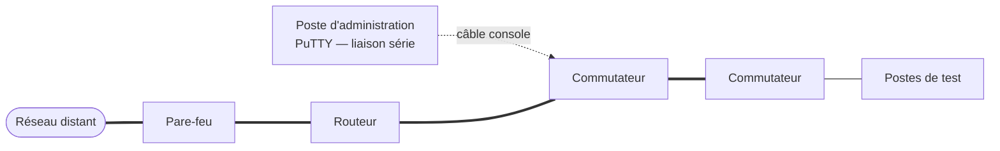
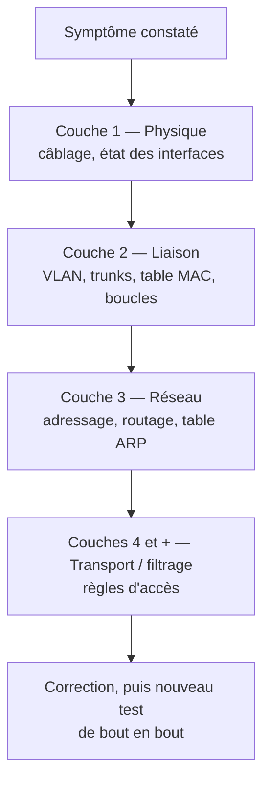

## Contexte

J'ai effectué mon stage de première année de BTS SIO au **Ministère de la Justice**, au sein
de la **Direction de l'informatique et des télécommunications (DIT)**. Le stage portait sur
l'infrastructure réseau d'un **bâtiment judiciaire** et s'est déroulé en deux volets
complémentaires :

1. un volet **gestion de projet** : recueillir les besoins, concevoir une proposition
   d'infrastructure et la présenter à l'oral ;
2. un volet **technique** : valider des configurations sur une maquette physique et résoudre
   des pannes injectées par mon tuteur, avec une méthode de diagnostic rigoureuse.

Le contexte judiciaire impose des exigences particulières : les données traitées par le greffe
et les magistrats sont sensibles, ce qui implique un cloisonnement des flux et une attention
constante à la sécurité.

## Volet 1 — Gestion de projet et recueil des besoins

### Conduite des entretiens

J'ai mené des **entretiens** auprès des différents départements métier du bâtiment et des
équipes de la DIT afin de recenser les besoins fonctionnels. Les profils rencontrés couvraient :

| Population | Types de besoins recueillis |
| --- | --- |
| **Greffe** | Postes de travail, accès aux applications métier, impression |
| **Magistrats** | Postes de travail, accès aux ressources et aux applications métier |
| **Services administratifs** | Postes bureautiques, accès aux ressources partagées |
| **Équipes de la DIT** | Contraintes techniques, exigences de sécurité, **flux sécurisés** vers les autres sites, exploitation |

Pour chaque entretien, ma démarche était la suivante :

1. **Préparer** une grille de questions (nombre d'utilisateurs, usages, applications, contraintes de confidentialité) ;
2. **Écouter et reformuler** le besoin exprimé dans le vocabulaire de l'interlocuteur, sans imposer de solution technique ;
3. **Consigner** les besoins par service ;
4. **Faire valider** la synthèse par l'équipe de la DIT, qui connaît les contraintes techniques et de sécurité du ministère.

### Traduction des besoins en proposition technique

Les besoins recueillis ont été regroupés pour construire une proposition d'infrastructure,
avec un principe directeur : **séparer les populations et les flux selon leur sensibilité**.
Les besoins du greffe, des magistrats et des services administratifs ne présentent pas le
même niveau de sensibilité, et les échanges avec l'extérieur du bâtiment doivent emprunter des
**flux sécurisés** conformes aux exigences de la DIT.

### Soutenance orale devant un jury de spécialistes

J'ai **présenté et défendu ma proposition à l'oral** devant un jury composé de spécialistes.
Cet exercice m'a demandé de :

- structurer une présentation allant **du besoin exprimé à la solution proposée** ;
- justifier chaque choix technique par un besoin ou une contrainte identifiés en entretien ;
- répondre aux questions techniques du jury et argumenter mes choix.

## Volet 2 — Lab physique et méthode de résolution d'incidents

### La maquette de validation

J'ai travaillé sur une **maquette physique** composée de **commutateurs**, de **routeurs** et de
**pare-feu**, interconnectée avec un **réseau distant**. Les équipements étaient administrés en
**ligne de commande (syntaxe de type Cisco IOS)** par **câble console et PuTTY** en liaison série.

_Schéma de principe : il ne représente pas l'infrastructure réelle du ministère._

### Les scénarios de pannes injectées

Mon tuteur introduisait volontairement des pannes sur la maquette, que je devais identifier puis
corriger. Les scénarios portaient sur quatre familles de problèmes :

| Famille de panne | Couche OSI principalement concernée |
| --- | --- |
| **Erreurs de câblage** (câble mal branché, mauvais port) | Couche 1 — Physique |
| **Boucles** de commutation | Couche 2 — Liaison |
| **Mauvaise encapsulation** (configuration 802.1Q incohérente entre deux équipements) | Couche 2 — Liaison |
| **Droits d'accès** (règles de filtrage bloquant un flux légitime) | Couches 3 et 4 — Réseau et transport |

### Méthodologie de diagnostic

Face à une panne, j'ai appliqué une méthode **ascendante, couche par couche du modèle OSI** :
on ne vérifie une couche que lorsque les couches inférieures sont validées. Cette démarche évite
de modifier la configuration « au hasard » et permet d'expliquer précisément l'origine du
problème.

Les outils utilisés à chaque étape :

| Étape | Commandes et vérifications |
| --- | --- |
| **Physique** | Vérification visuelle du câblage ; `show ip interface brief` et `show interfaces` pour l'état des ports (up / down) |
| **Liaison** | `show vlan brief`, `show interfaces trunk` (encapsulation et VLAN autorisés), `show spanning-tree`, inspection de la table MAC avec `show mac address-table` |
| **Réseau** | `ping` de proche en proche, `traceroute` pour localiser l'endroit où le trafic s'arrête, inspection de la table ARP avec `show arp`, `show ip route` |
| **Filtrage** | Lecture de la configuration (`show running-config`) et des règles d'accès, contrôle de leur ordre et de leur portée |

**Quelques réflexes acquis :**

- **Tester de proche en proche** : un `ping` vers la passerelle, puis vers le routeur suivant, puis vers le réseau distant ; le premier échec localise la zone de la panne.
- **Lire les tables plutôt que supposer** : la table MAC indique sur quel port un équipement est réellement vu ; la table ARP confirme la correspondance entre adresse IP et adresse MAC.
- **Comparer les deux extrémités d'un lien** : une encapsulation ou une liste de VLAN différente de part et d'autre d'un trunk suffit à interrompre le trafic.
- **Valider après correction** : chaque correction est suivie d'un test de bout en bout, pour s'assurer que la panne est résolue sans en avoir créé une autre.

## Bilan

**Compétences développées :**

- **Relationnelles et projet** : conduite d'entretiens avec des interlocuteurs métier et techniques, formalisation de besoins, présentation orale devant un jury de spécialistes.
- **Techniques** : administration d'équipements réseau en console via PuTTY, lecture des tables de commutation et d'adressage, diagnostic méthodique par couches OSI.
- **Posture professionnelle** : respect de la confidentialité propre à un environnement judiciaire, rigueur dans la documentation et la justification des choix.

**Ce que je retiens :** une infrastructure se conçoit d'abord à partir des **besoins des
utilisateurs**, et se valide par des **tests** ; face à une panne, la **méthode** compte davantage
que la mémorisation des commandes.
