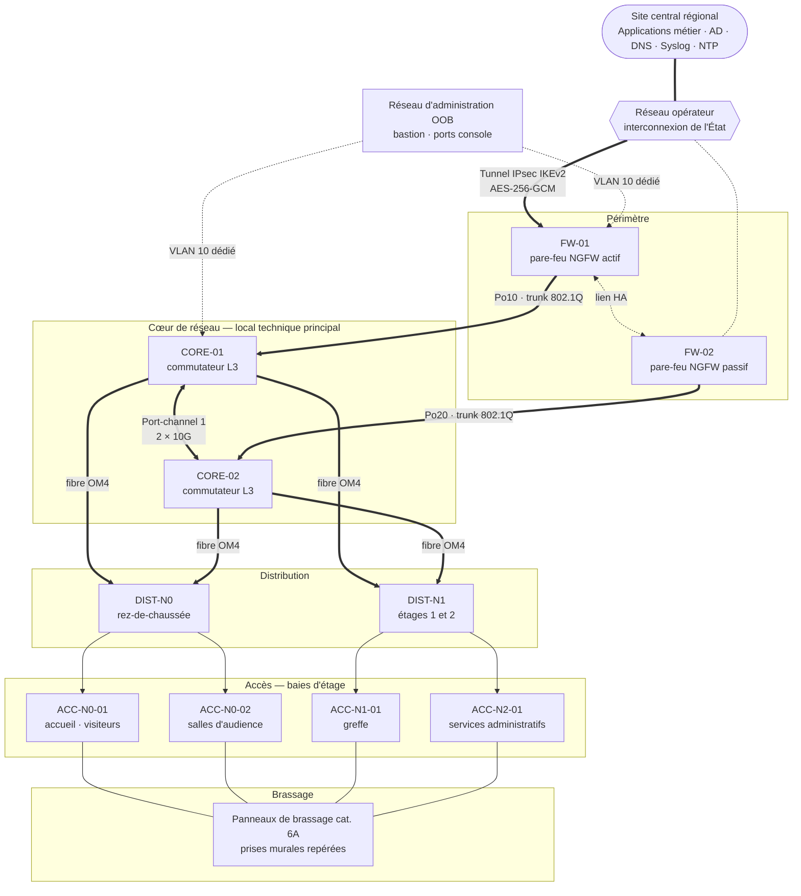

## Contexte et objectifs

Au cours de mon stage de première année au sein du service informatique régional d'une
direction du **Ministère de la Justice**, j'ai participé à la mise en service réseau d'un
**bâtiment neuf** accueillant à la fois des services administratifs et des services
judiciaires (greffe, accueil du public, salles d'audience).

Le bâtiment devait être opérationnel pour l'emménagement des agents, soit une **échéance
ferme de six semaines**. Il est rattaché à un site central régional qui héberge les
applications métier, l'annuaire, la messagerie et les services d'infrastructure (DNS, DHCP,
NTP de référence, collecteur de journaux).

**Objectifs fixés par mon tuteur :**

1. Concevoir un **plan d'adressage** et un **découpage en VLAN** cohérents avec les usages du bâtiment.
2. Préparer et **configurer les commutateurs** d'accès, de distribution et de cœur à partir des gabarits (_templates_) de l'administration.
3. Appliquer les **mesures de sécurité de niveau 2** exigées par la politique interne.
4. Rédiger la **matrice de flux** servant de base aux règles du pare-feu périmétrique.
5. Conduire la **recette** (tests d'étanchéité, journalisation, synchronisation horaire) et produire la documentation d'exploitation.

## Enjeux et contraintes

| Enjeu | Traduction technique |
| --- | --- |
| **Secret professionnel** — des données de procédures judiciaires transitent sur le réseau | Isolement strict des flux « greffe » ; aucun chemin réseau depuis les zones ouvertes au public |
| **Intégrité** — les documents produits ont une valeur juridique | Protection contre l'usurpation (DHCP Snooping, Dynamic ARP Inspection), équipements non modifiables hors bande d'administration |
| **Traçabilité** — toute action d'administration doit être imputable | Comptes nominatifs, journalisation centralisée horodatée, NTP obligatoire sur chaque équipement |
| **Conformité PSSIE** — Politique de sécurité des systèmes d'information de l'État | Cloisonnement, administration depuis un réseau dédié, chiffrement des interconnexions, refus par défaut |
| **Disponibilité** — accueil du public et audiences | Redondance cœur / pare-feu, liens montants agrégés, alimentation secourue des baies |

La PSSIE impose notamment de **cloisonner les systèmes selon leur sensibilité**, d'**administrer
les équipements depuis un réseau dédié** et de **journaliser les événements de sécurité**. Ces
trois principes ont guidé l'ensemble des choix ci-dessous.

## Topologie

L'architecture retenue est un modèle hiérarchique à trois niveaux (cœur, distribution, accès).
Le routage inter-VLAN n'est **pas** réalisé par le cœur : chaque passerelle est portée par le
cluster de pare-feu, ce qui garantit que **tout flux entre deux zones traverse une politique de
filtrage** et est journalisé.



## Plan d'adressage et découpage VLAN

Le site dispose d'un bloc privé attribué par le site central (anonymisé ici en
`10.42.0.0/16`). Les VLAN visiteurs utilisent volontairement une **plage distincte**, non
annoncée dans le tunnel vers le site central : une erreur de règle ne peut donc pas les exposer.

| VLAN | Nom | Réseau | Passerelle | Rôle / sensibilité |
| --- | --- | --- | --- | --- |
| 10 | `MGMT-OOB` | `10.42.10.0/24` | `10.42.10.1` | Administration des équipements (SSH, SNMPv3). Accessible uniquement depuis le bastion. |
| 20 | `GREFFE` | `10.42.20.0/23` | `10.42.20.1` | Postes et imprimantes du greffe — **zone la plus sensible**. |
| 30 | `ADMIN` | `10.42.30.0/24` | `10.42.30.1` | Services administratifs, ressources humaines, logistique. |
| 40 | `AUDIENCE` | `10.42.40.0/26` | `10.42.40.1` | Équipements des salles d'audience (visioconférence, affichage). |
| 50 | `VISITEURS` | `172.16.50.0/24` | `172.16.50.1` | Wi-Fi public : accès Internet uniquement, isolation client. |
| 998 | `NATIF-INUTILISE` | — | — | VLAN natif des trunks, **aucun port, aucune IP**. |
| 999 | `PARKING` | — | — | Ports inutilisés, administrativement désactivés. |
| — | Transit | `10.42.255.0/30` | — | Lien d'interconnexion pare-feu ↔ tunnel. |

**Choix de dimensionnement :**

- Le VLAN `GREFFE` est un `/23` (510 hôtes) : le greffe représente la moitié des effectifs et l'extension d'un étage est déjà prévue.
- Le VLAN `AUDIENCE` est un `/26` (62 hôtes) : peu d'équipements, surface d'adressage minimale.
- Les passerelles sont systématiquement en `.1`, les équipements réseau en `.2` à `.30` et les plages DHCP commencent en `.50`, conformément à la convention du site central.

## Implémentation technique

### Socle commun à tous les commutateurs

Avant toute configuration de VLAN, chaque équipement reçoit le socle de durcissement de
l'administration. Extrait commenté (identifiants fictifs) :

```cisco
! --- Identité et accès d'administration ---
hostname ACC-N1-01
no ip domain-lookup                          ! évite les résolutions DNS sur faute de frappe
ip domain-name site-b.justice.intra          ! domaine fictif
crypto key generate rsa modulus 3072         ! clé SSH (≥ 3072 bits)
ip ssh version 2
ip ssh time-out 60
ip ssh authentication-retries 3
login block-for 120 attempts 3 within 60     ! anti force brute
no ip http server                            ! aucune interface web
no ip http secure-server
service password-encryption
no cdp run                                   ! pas de divulgation de topologie aux postes
!
username adm.tvalentin privilege 15 algorithm-type scrypt secret <masqué>
!
! --- Bannière légale (obligatoire sur les SI de l'État) ---
banner login ^
Accès réservé aux personnes autorisées. Toute connexion est journalisée.
Toute tentative d'accès frauduleux est passible de poursuites (art. 323-1 du Code pénal).
^
!
! --- Accès VTY limité au réseau d'administration ---
ip access-list standard ACL-MGMT
 permit 10.42.10.0 0.0.0.255
 deny   any log
line vty 0 15
 access-class ACL-MGMT in
 transport input ssh
 login local
 exec-timeout 10 0
line con 0
 login local
 exec-timeout 5 0
```

### Création des VLAN

Le protocole VTP est désactivé (mode `transparent`) : une base VLAN propagée
automatiquement présente un risque d'effacement complet du plan de VLAN par un commutateur
mal configuré.

```cisco
vtp mode transparent
!
vlan 10
 name MGMT-OOB
vlan 20
 name GREFFE
vlan 30
 name ADMIN
vlan 40
 name AUDIENCE
vlan 50
 name VISITEURS
vlan 998
 name NATIF-INUTILISE
vlan 999
 name PARKING
!
! Interface d'administration du commutateur : uniquement dans le VLAN 10
interface Vlan10
 description MGMT-OOB
 ip address 10.42.10.21 255.255.255.0
 no shutdown
ip default-gateway 10.42.10.1
```

### Liens montants : trunks 802.1Q

Les trunks sont configurés **statiquement**, avec négociation DTP désactivée, un VLAN natif
inutilisé et une **liste explicite** de VLAN autorisés. Cela neutralise les attaques de
_VLAN hopping_ (usurpation de trunk DTP et double étiquetage).

```cisco
! Uplinks agrégés vers DIST-N1 (LACP)
interface range TenGigabitEthernet1/1/1 - 2
 description UPLINK-DIST-N1
 channel-group 1 mode active                 ! LACP actif
!
interface Port-channel1
 description UPLINK-DIST-N1
 switchport mode trunk
 switchport nonegotiate                      ! DTP désactivé
 switchport trunk native vlan 998            ! VLAN natif sans hôte
 switchport trunk allowed vlan 10,20,30      ! seuls les VLAN utiles à cette baie
 ip dhcp snooping trust                      ! les réponses DHCP légitimes arrivent par ici
 ip arp inspection trust
!
! Le VLAN natif est étiqueté lui aussi : protection contre le double tagging
vlan dot1q tag native
```

> Le point de vigilance a été la **cohérence de la liste `allowed vlan`** de bout en bout :
> un VLAN oublié sur un seul trunk intermédiaire suffit à isoler un étage. J'ai donc tenu un
> tableau « VLAN × lien » vérifié avec `show interfaces trunk` sur chaque équipement.

### Ports d'accès : Port-Security, BPDU Guard, DHCP Snooping

```cisco
! --- Protection STP globale ---
spanning-tree mode rapid-pvst
spanning-tree portfast bpduguard default     ! tout port PortFast recevant une BPDU passe en err-disable
spanning-tree extend system-id
!
! --- Anti-usurpation DHCP et ARP ---
ip dhcp snooping
ip dhcp snooping vlan 20,30,40
no ip dhcp snooping information option       ! le relais est porté par le pare-feu
ip arp inspection vlan 20,30,40
!
! --- Postes du greffe : 1 poste + 1 téléphone maximum par prise ---
interface range GigabitEthernet1/0/1 - 36
 description ACCES-GREFFE
 switchport mode access
 switchport access vlan 20
 switchport nonegotiate
 switchport port-security
 switchport port-security maximum 2
 switchport port-security mac-address sticky ! apprentissage puis mémorisation des MAC
 switchport port-security violation restrict ! trame rejetée + trap/syslog, port maintenu
 switchport port-security aging time 1440
 spanning-tree portfast
 spanning-tree bpduguard enable
 ip dhcp snooping limit rate 15              ! limite l'épuisement du pool DHCP
 storm-control broadcast level 5.00
 no shutdown
!
! --- Ports non utilisés : VLAN parking + arrêt administratif ---
interface range GigabitEthernet1/0/37 - 48
 description NON-UTILISE
 switchport mode access
 switchport access vlan 999
 shutdown
!
! --- Récupération automatique encadrée des ports en erreur ---
errdisable recovery cause bpduguard
errdisable recovery cause psecure-violation
errdisable recovery interval 900
```

**Pourquoi `violation restrict` plutôt que `shutdown` ?** Sur les prises du greffe, une
coupure franche aurait bloqué un agent en pleine saisie à chaque déplacement de poste. Le mode
`restrict` rejette les trames des MAC non autorisées **et génère un message Syslog**, ce qui
préserve la traçabilité sans dégrader le service. En revanche, les ports de l'accueil
(zone publique) sont en `violation shutdown` : un équipement inconnu branché à l'accueil doit
couper le port immédiatement.

### Journalisation centralisée et synchronisation NTP

Sans horloge commune, des journaux ne sont pas corrélables — et donc pas exploitables en cas
d'incident. Chaque équipement se synchronise sur le NTP de référence du site central
(authentifié) et envoie ses journaux au collecteur Syslog.

```cisco
! --- NTP authentifié ---
ntp authentication-key 1 hmac-sha2-256 <masqué>
ntp authenticate
ntp trusted-key 1
ntp source Vlan10
ntp server 10.10.0.123 key 1 prefer          ! NTP de référence du site central (fictif)
ntp server 10.10.0.124 key 1
clock timezone CET 1 0
clock summer-time CEST recurring last Sun Mar 2:00 last Sun Oct 3:00
!
! --- Syslog ---
service timestamps log datetime msec localtime show-timezone year
service timestamps debug datetime msec localtime show-timezone year
service sequence-numbers                     ! détection de journaux manquants
logging buffered 64000 informational
logging source-interface Vlan10
logging host 10.10.0.14                      ! collecteur central (fictif)
logging trap informational
logging origin-id hostname
archive
 log config
  logging enable
  notify syslog contenttype plaintext         ! chaque commande de config est journalisée
  hidekeys
```

La directive `archive log config` est essentielle pour la **traçabilité** : chaque commande
saisie en mode configuration est envoyée au Syslog avec l'identifiant nominatif de
l'administrateur.

## Filtrage périmétrique : refus par défaut

J'ai rédigé la matrice de flux à partir d'entretiens avec les responsables de service, puis
mon tuteur l'a traduite en règles sur le pare-feu (constructeur non communiqué). La politique
est **ordonnée**, **nominative** (chaque règle a un propriétaire et une justification) et se
termine par un **refus explicite journalisé**.

| # | Source | Destination | Service | Action | Justification |
| --- | --- | --- | --- | --- | --- |
| 1 | Bastion `10.42.10.5` | Équipements `VLAN 10` | SSH 22, HTTPS 443, SNMPv3 161 | ✅ Autoriser | Administration depuis un poste dédié uniquement |
| 2 | Tous équipements | Collecteurs site central | Syslog UDP 514, NTP UDP 123 | ✅ Autoriser | Traçabilité et horodatage |
| 3 | `GREFFE` | Applications métier (site central) | HTTPS 443 | ✅ Autoriser | Logiciels de procédure |
| 4 | `GREFFE`, `ADMIN` | Contrôleurs de domaine (site central) | DNS 53, Kerberos 88, LDAPS 636, SMB 445 | ✅ Autoriser | Authentification, GPO, partages |
| 5 | `ADMIN` | Serveurs bureautiques (site central) | HTTPS 443, SMB 445 | ✅ Autoriser | Messagerie, fichiers |
| 6 | `AUDIENCE` | Passerelle visio (site central) | SIP-TLS 5061, SRTP UDP 16384–32767 | ✅ Autoriser | Audiences à distance |
| 7 | `VISITEURS` | Internet (NAT) | HTTP 80, HTTPS 443, DNS 53 vers résolveur public | ✅ Autoriser | Wi-Fi public, filtrage URL actif |
| 8 | `VISITEURS` | `10.0.0.0/8`, `172.16.0.0/12`, `192.168.0.0/16` | Tous | ⛔ Refuser + journaliser | Isolement absolu du public |
| 9 | `GREFFE` ↔ `ADMIN` ↔ `AUDIENCE` | — | Tous | ⛔ Refuser + journaliser | Cloisonnement inter-services |
| 10 | Tout | Tout | Tout | ⛔ **Refuser + journaliser** | **Refus par défaut** |

Le tunnel vers le site central est un **IPsec IKEv2** (AES-256-GCM, groupe DH 20, PFS), dont
les sélecteurs de trafic n'incluent que les réseaux `10.42.0.0/16` : la plage visiteurs
`172.16.50.0/24` ne peut physiquement pas y entrer.

## Recette et validation

### Matrice de tests d'étanchéité inter-VLAN

Tests réalisés depuis un poste de recette branché successivement dans chaque VLAN, avec
`ping`, `nc -zv` sur les ports autorisés/interdits et un `nmap -sS -Pn --top-ports 100`
vers une cible de chaque zone. Les résultats ont été confrontés aux journaux du pare-feu
(chaque refus attendu devait apparaître avec la bonne règle).

| Source ↓ / Destination → | MGMT (10) | GREFFE (20) | ADMIN (30) | AUDIENCE (40) | Site central | Internet |
| --- | --- | --- | --- | --- | --- | --- |
| **MGMT (bastion)** | ✅ SSH/HTTPS | ⛔ | ⛔ | ⛔ | ✅ Syslog/NTP | ⛔ |
| **GREFFE** | ⛔ | ✅ intra-VLAN | ⛔ règle 9 | ⛔ règle 9 | ✅ flux 3 et 4 | ⛔ |
| **ADMIN** | ⛔ | ⛔ règle 9 | ✅ intra-VLAN | ⛔ règle 9 | ✅ flux 4 et 5 | ⛔ |
| **AUDIENCE** | ⛔ | ⛔ | ⛔ | ✅ intra-VLAN | ✅ visio uniquement | ⛔ |
| **VISITEURS** | ⛔ règle 8 | ⛔ règle 8 | ⛔ règle 8 | ⛔ règle 8 | ⛔ hors tunnel | ✅ 80/443 |

**Résultat : 30 cas testés, 29 conformes au premier passage.** L'écart concernait les
imprimantes du greffe, que le serveur d'impression du site central ne parvenait pas à
interroger (SNMP). La règle 3 a été complétée par un flux SNMP en lecture seule depuis ce seul
serveur, puis le test a été rejoué avec succès.

### Tests de sécurité de niveau 2

| Test | Méthode | Résultat attendu | Résultat |
| --- | --- | --- | --- |
| Branchement d'un commutateur non autorisé | Switch de test raccordé sur une prise greffe | Port `err-disabled` (BPDU Guard) + Syslog | ✅ Conforme |
| Troisième adresse MAC sur une prise | Hub + 3 postes | Trames rejetées, compteur de violations incrémenté | ✅ Conforme |
| Serveur DHCP pirate | `dnsmasq` sur un poste de test | Offres DHCP bloquées (DHCP Snooping) | ✅ Conforme |
| Usurpation ARP | `arpspoof` vers la passerelle | Paquets rejetés par DAI, message `%SW_DAI-4-DHCP_SNOOPING_DENY` | ✅ Conforme |
| Négociation de trunk depuis un poste | `yersinia` (attaque DTP) | Aucun trunk formé (`nonegotiate`) | ✅ Conforme |

Ces tests offensifs ont été réalisés **sur autorisation écrite du responsable**, sur un créneau
dédié et avant l'emménagement des agents.

### Journalisation et horodatage

- `show ntp associations` : tous les équipements synchronisés (`*` sur le serveur préféré, strate 3).
- Génération volontaire d'événements (violation de port, connexion SSH, modification de configuration) et vérification de leur arrivée sur le collecteur **avec le bon nom d'hôte, le bon horodatage et l'identifiant de l'administrateur**.
- Contrôle de la continuité des numéros de séquence Syslog.

## Gestion des imprévus sur le terrain

| Imprévu | Diagnostic | Action corrective |
| --- | --- | --- |
| **Repérage des prises inversé** entre le plan de l'architecte et les panneaux de brassage (étage 1, 24 prises) | Postes du greffe se retrouvant dans le VLAN `ADMIN` ; détecté par l'écart entre la table `show mac address-table` et l'inventaire | Relevé contradictoire prise par prise avec le prestataire, correction des étiquettes et mise à jour du plan de brassage **avant** toute modification logicielle |
| **Liens cuivre défaillants** à la certification (échec NEXT sur 3 liaisons) | Rapports du certificateur de câblage fournis par le prestataire, erreurs CRC visibles avec `show interfaces counters errors` | Réfection des connecteurs par le prestataire, nouvelle certification ; ports concernés maintenus en VLAN parking jusqu'à validation |
| **Jarretières optiques incompatibles** (LC côté commutateur, SC côté tiroir) | Constaté lors du raccordement cœur ↔ distribution | Commande de jarretières LC/SC OM4 ; liens provisoires sur un seul chemin redondant pendant 48 h, documentés dans le journal de chantier |
| **Retard de livraison** d'un commutateur d'accès | Planning fournisseur | Pré-configuration hors ligne à partir du gabarit, puis déploiement par copie de configuration (`copy tftp: startup-config` depuis le bastion) le jour de la réception |

Ces imprévus m'ont appris qu'**un réseau n'est jamais plus fiable que sa documentation** : la
correction du plan de brassage a pris plus de temps que la configuration de tous les
commutateurs réunis.

## Livrables produits

- Plan d'adressage et tableau des VLAN (versionnés).
- Gabarits de configuration commentés pour les commutateurs d'accès et de distribution.
- Matrice de flux ayant servi à la politique du pare-feu.
- Cahier de recette complet (tests d'étanchéité, tests de niveau 2, journalisation) signé par le tuteur.
- Plan de brassage corrigé et fiche d'exploitation « ajout d'un poste / d'une prise ».

## Bilan et compétences mobilisées

**Ce que j'ai appris :**

- Travailler dans un cadre réglementaire (PSSIE) où **chaque choix technique doit être justifié** et traçable.
- La différence entre une configuration qui fonctionne et une configuration **défendable** : refus par défaut, journalisation, protections de niveau 2.
- Le travail en mode projet avec des interlocuteurs multiples (prestataire de câblage, services utilisateurs, site central) et un planning contraint.

**Axes d'amélioration identifiés :**

- Remplacer Port-Security par une authentification **802.1X** (NAC) adossée à l'annuaire, pour ne plus reposer sur l'adresse MAC, falsifiable.
- Automatiser la génération des configurations à partir d'un inventaire (Ansible + modèles Jinja2) pour supprimer les erreurs de recopie.
- Superviser les ports en `err-disable` et les violations de sécurité via un outil de supervision avec alertes.
