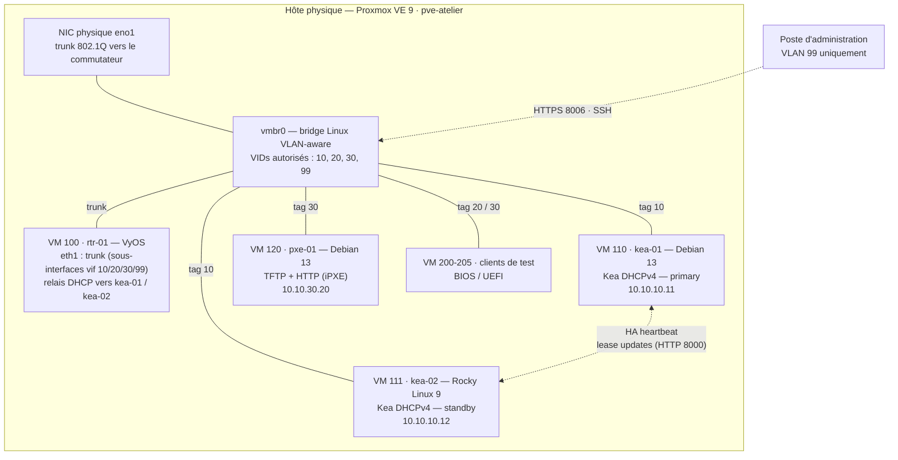

## Contexte et cahier des charges

L'atelier simule la demande d'une PME (60 postes, un seul serveur physique) dont le serveur
DHCP unique sous Windows tombe régulièrement en panne, bloquant les arrivées du matin. Le
cahier des charges fourni par l'enseignant impose :

- **Virtualiser** les services réseau sur un hyperviseur libre, sans licence.
- **Segmenter** le réseau en VLAN (serveurs, utilisateurs, déploiement, administration).
- Mettre en place un **DHCP redondant** : la panne d'un serveur ne doit pas empêcher l'attribution d'adresses.
- Permettre le **déploiement de postes par le réseau (PXE)**, en BIOS comme en UEFI.
- Fournir une **procédure de test de bascule** et des **scripts** reproductibles.

## Architecture cible



### Plan d'adressage

| VLAN | Nom | Réseau | Passerelle (VyOS) | Pool DHCP | Usage |
| --- | --- | --- | --- | --- | --- |
| 10 | `SRV` | `10.10.10.0/24` | `10.10.10.1` | — (adresses statiques) | Serveurs Kea, services internes |
| 20 | `USERS` | `10.10.20.0/24` | `10.10.20.1` | `10.10.20.50 – 10.10.20.250` | Postes utilisateurs |
| 30 | `DEPLOY` | `10.10.30.0/24` | `10.10.30.1` | `10.10.30.100 – 10.10.30.200` | Déploiement PXE |
| 99 | `MGMT` | `10.10.99.0/24` | `10.10.99.1` | — | Interface d'administration Proxmox, SSH |

Les serveurs DHCP ne sont présents que dans le VLAN 10 : ce sont les **relais DHCP** du
routeur (équivalent des `ip helper-address` Cisco) qui transmettent les requêtes des autres
VLAN.

## 1. Installation et durcissement de Proxmox VE

### Installation

Installation depuis l'ISO officielle (vérification préalable de la somme SHA-256 publiée),
sur un volume **ZFS miroir (RAID1)** de deux disques SSD, puis passage sur le dépôt
`no-subscription` et mise à jour complète :

```bash
# Désactivation du dépôt entreprise (pas de licence) et activation du dépôt communautaire
sed -i 's/^Enabled: yes/Enabled: no/' /etc/apt/sources.list.d/pve-enterprise.sources
cat > /etc/apt/sources.list.d/pve-no-subscription.sources <<'EOF'
Types: deb
URIs: http://download.proxmox.com/debian/pve
Suites: trixie
Components: pve-no-subscription
Signed-By: /usr/share/keyrings/proxmox-archive-keyring.gpg
EOF
apt update && apt full-upgrade -y
```

### Durcissement

| Mesure | Mise en œuvre | Risque couvert |
| --- | --- | --- |
| Compte nominatif, pas d'usage quotidien de `root@pam` | `pveum user add tvalentin@pve` + rôle `PVEAdmin` sur `/` | Imputabilité des actions |
| **Double authentification TOTP** | Activée pour `root@pam` et tous les comptes | Vol de mot de passe |
| Interface d'administration limitée au VLAN 99 | Pare-feu Proxmox au niveau datacenter | Exposition de l'interface web (8006) |
| SSH par clé uniquement | `PermitRootLogin prohibit-password`, `PasswordAuthentication no` | Force brute SSH |
| Protection anti force brute de l'interface web | `fail2ban` avec filtre sur `pvedaemon` | Force brute sur 8006 |
| Services inutiles désactivés | `systemctl disable --now rpcbind` (NFS non utilisé) | Réduction de surface |

Règles du pare-feu Proxmox (`/etc/pve/firewall/cluster.fw`) — politique d'entrée en
**refus par défaut** :

```ini
[OPTIONS]
enable: 1
policy_in: DROP
policy_out: ACCEPT

[IPSET mgmt]
10.10.99.0/24 # VLAN d'administration

[RULES]
IN ACCEPT -source +mgmt -p tcp -dport 8006 -log nolog # Interface web
IN ACCEPT -source +mgmt -p tcp -dport 22 -log nolog   # SSH
IN ACCEPT -source +mgmt -p icmp -log nolog            # Supervision
```

Filtre `fail2ban` pour l'interface web :

```ini
# /etc/fail2ban/filter.d/proxmox.conf
[Definition]
failregex = pvedaemon\[.*authentication (verification )?failure; rhost=<HOST> user=\S+ msg=.*
ignoreregex =
journalmatch = _SYSTEMD_UNIT=pvedaemon.service

# /etc/fail2ban/jail.d/proxmox.conf
[proxmox]
enabled  = true
port     = https,http,8006
filter   = proxmox
backend  = systemd
maxretry = 3
findtime = 10m
bantime  = 1h
```

## 2. Bridge Linux VLAN-aware

Plutôt qu'un bridge par VLAN (`vmbr10`, `vmbr20`…), j'ai choisi **un unique bridge
VLAN-aware** : l'étiquette 802.1Q est simplement portée par la carte réseau de chaque VM.
Ajouter un VLAN ne nécessite ainsi aucun redémarrage du réseau de l'hôte.

```bash
# /etc/network/interfaces (extrait)
auto eno1
iface eno1 inet manual

auto vmbr0
iface vmbr0 inet manual
    bridge-ports eno1
    bridge-stp off
    bridge-fd 0
    bridge-vlan-aware yes
    bridge-vids 10 20 30 99        # liste blanche : aucun autre VLAN ne transite

# Interface d'administration de l'hôte, uniquement dans le VLAN 99
auto vmbr0.99
iface vmbr0.99 inet static
    address 10.10.99.10/24
    gateway 10.10.99.1
```

Rattachement des VM :

```bash
qm set 100 --net1 virtio,bridge=vmbr0,trunks='10;20;30;99'  # routeur : trunk filtré
qm set 110 --net0 virtio,bridge=vmbr0,tag=10,firewall=1     # kea-01 : accès VLAN 10
qm set 111 --net0 virtio,bridge=vmbr0,tag=10,firewall=1     # kea-02 : accès VLAN 10
qm set 120 --net0 virtio,bridge=vmbr0,tag=30,firewall=1     # pxe-01 : accès VLAN 30
```

Vérification côté hôte : `bridge vlan show` liste chaque interface `tap` avec son VLAN
`PVID Egress Untagged`, et le port du routeur avec les quatre VID étiquetés.

## 3. Routeur virtuel et relais DHCP

Le routeur VyOS assure le routage inter-VLAN et le filtrage entre zones. Chaque VLAN est une
sous-interface (`vif`) de `eth1` :

```bash
# Sous-interfaces 802.1Q
set interfaces ethernet eth1 vif 10 address '10.10.10.1/24'
set interfaces ethernet eth1 vif 20 address '10.10.20.1/24'
set interfaces ethernet eth1 vif 30 address '10.10.30.1/24'
set interfaces ethernet eth1 vif 99 address '10.10.99.1/24'

# Relais DHCP (équivalent ip helper-address) vers les DEUX serveurs Kea
set service dhcp-relay listen-interface 'eth1.20'
set service dhcp-relay listen-interface 'eth1.30'
set service dhcp-relay upstream-interface 'eth1.10'
set service dhcp-relay server '10.10.10.11'
set service dhcp-relay server '10.10.10.12'
set service dhcp-relay relay-options relay-agents-packets 'discard'

# Filtrage : les utilisateurs n'atteignent pas l'administration
set firewall ipv4 forward filter default-action 'drop'
set firewall ipv4 forward filter rule 10 action 'accept'
set firewall ipv4 forward filter rule 10 state 'established'
set firewall ipv4 forward filter rule 10 state 'related'
set firewall ipv4 forward filter rule 20 action 'accept'
set firewall ipv4 forward filter rule 20 source address '10.10.99.0/24'
set firewall ipv4 forward filter rule 30 action 'accept'
set firewall ipv4 forward filter rule 30 inbound-interface name 'eth1.20'
set firewall ipv4 forward filter rule 30 destination address '10.10.10.0/24'
set firewall ipv4 forward filter rule 30 protocol 'tcp_udp'
set firewall ipv4 forward filter rule 30 destination port '53,80,443'
commit ; save
```

L'équivalent sur un routeur Cisco (vu en cours et testé sur Packet Tracer) :

```cisco
interface GigabitEthernet0/0.20
 description USERS
 encapsulation dot1Q 20
 ip address 10.10.20.1 255.255.255.0
 ip helper-address 10.10.10.11               ! kea-01 (primary)
 ip helper-address 10.10.10.12               ! kea-02 (standby)
```

> **Point clé :** le relais renseigne le champ `giaddr` avec l'adresse de l'interface de
> réception (`10.10.20.1`). C'est ce champ qui permet à Kea de choisir le bon sous-réseau —
> un relais oublié sur un VLAN se traduit donc par des clients en `169.254.x.x` (APIPA).

## 4. Cluster Kea DHCP en haute disponibilité

J'ai retenu **Kea** (successeur d'ISC DHCP, en fin de vie depuis 2022) pour son mécanisme de
haute disponibilité intégré (_hook_ `libdhcp_ha`) et sa configuration JSON facilement
versionnable. Le mode **hot-standby** a été préféré au mode _load-balancing_ : plus simple à
diagnostiquer, et la charge d'une PME ne justifie pas de répartir les requêtes.

- `kea-01` (Debian 13, `apt install kea-dhcp4-server kea-ctrl-agent`) : **primary**
- `kea-02` (Rocky Linux 9, dépôt officiel ISC) : **standby**, reçoit chaque bail en temps réel

Utiliser deux distributions différentes était un choix délibéré : cela évite qu'une même mise
à jour défectueuse fasse tomber les deux nœuds simultanément.

```json
{
  "Dhcp4": {
    "interfaces-config": { "interfaces": ["ens18"], "dhcp-socket-type": "udp" },
    "lease-database": { "type": "memfile", "persist": true, "lfc-interval": 3600 },
    "valid-lifetime": 28800,
    "renew-timer": 14400,
    "rebind-timer": 25200,

    "hooks-libraries": [
      { "library": "/usr/lib/x86_64-linux-gnu/kea/hooks/libdhcp_lease_cmds.so" },
      {
        "library": "/usr/lib/x86_64-linux-gnu/kea/hooks/libdhcp_ha.so",
        "parameters": {
          "high-availability": [{
            "this-server-name": "kea-01",
            "mode": "hot-standby",
            "heartbeat-delay": 10000,
            "max-response-delay": 30000,
            "max-ack-delay": 5000,
            "max-unacked-clients": 3,
            "peers": [
              { "name": "kea-01", "url": "http://10.10.10.11:8000/", "role": "primary",  "auto-failover": true },
              { "name": "kea-02", "url": "http://10.10.10.12:8000/", "role": "standby", "auto-failover": true }
            ]
          }]
        }
      }
    ],

    "client-classes": [
      {
        "name": "PXE-UEFI-x64",
        "test": "option[93].hex == 0x0007 or option[93].hex == 0x0009",
        "next-server": "10.10.30.20",
        "boot-file-name": "ipxe.efi"
      },
      {
        "name": "PXE-BIOS",
        "test": "option[93].hex == 0x0000",
        "next-server": "10.10.30.20",
        "boot-file-name": "undionly.kpxe"
      },
      {
        "name": "iPXE",
        "test": "substring(option[77].hex, 0, 4) == 'iPXE'",
        "boot-file-name": "http://10.10.30.20/boot.ipxe"
      }
    ],

    "subnet4": [
      {
        "id": 20,
        "subnet": "10.10.20.0/24",
        "pools": [{ "pool": "10.10.20.50 - 10.10.20.250" }],
        "option-data": [
          { "name": "routers", "data": "10.10.20.1" },
          { "name": "domain-name-servers", "data": "10.10.10.53" },
          { "name": "domain-name", "data": "atelier.lan" }
        ]
      },
      {
        "id": 30,
        "subnet": "10.10.30.0/24",
        "pools": [{ "pool": "10.10.30.100 - 10.10.30.200" }],
        "option-data": [
          { "name": "routers", "data": "10.10.30.1" },
          { "name": "domain-name-servers", "data": "10.10.10.53" },
          { "name": "tftp-server-name", "data": "10.10.30.20" }
        ]
      }
    ],

    "loggers": [{
      "name": "kea-dhcp4",
      "output-options": [{ "output": "syslog" }],
      "severity": "INFO"
    }]
  }
}
```

**Explications des choix :**

- **Option 93** (_Client System Architecture_) : distingue un client BIOS (`0x0000`) d'un client UEFI x64 (`0x0007` / `0x0009`) pour lui servir le bon chargeur.
- **Classe `iPXE`** : une fois iPXE chargé, il refait une requête DHCP avec l'option 77 `iPXE` ; on lui renvoie alors un script HTTP au lieu du chargeur, ce qui évite la boucle infinie de démarrage.
- **`max-unacked-clients: 3`** : le standby ne prend la main que s'il constate que le primary ignore réellement des clients, et pas seulement sur une perte de lien de synchronisation — protection contre le _split-brain_.

L'API de contrôle HTTP (port 8000) est **restreinte au VLAN 10** par `nftables` sur chaque
nœud :

```bash
nft add rule inet filter input ip saddr { 10.10.10.11, 10.10.10.12 } tcp dport 8000 accept
nft add rule inet filter input tcp dport 8000 drop
```

## 5. Scripts de déploiement automatique

### Création des VM depuis un modèle cloud-init

```bash
#!/usr/bin/env bash
# deploy-vm.sh — clone un modèle cloud-init et le rattache au bon VLAN.
# Usage : ./deploy-vm.sh <vmid> <nom> <vlan> <ip/cidr> <passerelle>
set -euo pipefail

readonly TEMPLATE_ID=9000               # modèle Debian 13 cloud-init
readonly STORAGE="local-zfs"
readonly SSH_KEY="/root/.ssh/atelier_ed25519.pub"

die() { echo "[ERREUR] $*" >&2; exit 1; }

[[ $# -eq 5 ]] || die "usage : $0 <vmid> <nom> <vlan> <ip/cidr> <passerelle>"
VMID=$1; NAME=$2; VLAN=$3; IP=$4; GW=$5

[[ $VLAN =~ ^(10|20|30|99)$ ]] || die "VLAN $VLAN non autorisé sur vmbr0"
qm status "$VMID" &>/dev/null && die "La VM $VMID existe déjà (script idempotent : aucune action)"

echo "[+] Clonage du modèle $TEMPLATE_ID → $VMID ($NAME)"
qm clone "$TEMPLATE_ID" "$VMID" --name "$NAME" --full --storage "$STORAGE"

echo "[+] Réseau : vmbr0, VLAN $VLAN, $IP"
qm set "$VMID" \
  --net0 "virtio,bridge=vmbr0,tag=${VLAN},firewall=1" \
  --ipconfig0 "ip=${IP},gw=${GW}" \
  --nameserver 10.10.10.53 \
  --sshkeys "$SSH_KEY" \
  --ciuser tvalentin \
  --onboot 1

qm start "$VMID"
echo "[OK] $NAME démarrée — ssh tvalentin@${IP%/*}"
```

### Installation et vérification de Kea

```bash
#!/usr/bin/env bash
# install-kea.sh — installe Kea, déploie la configuration versionnée et la valide.
set -euo pipefail

ROLE=${1:?usage : $0 primary|standby}
CONF_SRC="./kea-dhcp4.${ROLE}.json"

if command -v apt-get >/dev/null; then
  apt-get install -y kea-dhcp4-server kea-ctrl-agent
  SERVICE=kea-dhcp4-server
else
  dnf install -y isc-kea-dhcp4 isc-kea-ctrl-agent isc-kea-hooks
  SERVICE=kea-dhcp4
fi

install -m 0640 -o root -g _kea "$CONF_SRC" /etc/kea/kea-dhcp4.conf 2>/dev/null \
  || install -m 0640 "$CONF_SRC" /etc/kea/kea-dhcp4.conf

# Refuse de redémarrer sur une configuration invalide
kea-dhcp4 -t /etc/kea/kea-dhcp4.conf || { echo "[ERREUR] configuration Kea invalide" >&2; exit 1; }

systemctl enable --now "$SERVICE" kea-ctrl-agent
systemctl restart "$SERVICE"
echo "[OK] Kea ($ROLE) actif"
```

Les deux scripts sont **idempotents** (relançables sans effet de bord) et échouent
explicitement (`set -euo pipefail`) au lieu de laisser une installation à moitié faite.

## 6. Tests de bascule et recette

| # | Scénario | Procédure | Résultat attendu | Résultat |
| --- | --- | --- | --- | --- |
| 1 | Fonctionnement nominal | `dhclient -v` depuis un client VLAN 20 | Bail servi par `kea-01`, route et DNS corrects | ✅ |
| 2 | Synchronisation des baux | Comparer `lease4-get-all` sur les deux nœuds | Baux identiques | ✅ |
| 3 | **Panne du primary** | `qm stop 110` puis nouvelles demandes DHCP | `kea-02` passe en `partner-down` et sert les clients | ✅ en 38 s |
| 4 | Retour du primary | `qm start 110` | Resynchronisation, `kea-01` redevient actif | ✅ |
| 5 | Coupure du lien HA seule | Blocage du port 8000 (nft) sans arrêter Kea | **Pas** de bascule tant que le primary répond aux clients | ✅ |
| 6 | PXE BIOS | VM SeaBIOS dans le VLAN 30 | Téléchargement de `undionly.kpxe` puis menu iPXE | ✅ |
| 7 | PXE UEFI | VM OVMF dans le VLAN 30 | Téléchargement de `ipxe.efi` puis menu iPXE | ✅ après correctif |
| 8 | Étanchéité | Client VLAN 20 → `10.10.99.10:8006` | Connexion refusée | ✅ |

Vérification de l'état HA pendant le test n° 3 :

```bash
curl -s -X POST http://10.10.10.12:8000/ \
  -H 'Content-Type: application/json' \
  -d '{"command": "ha-heartbeat", "service": ["dhcp4"]}' | jq '.[0].arguments.state'
# "partner-down"
```

**Temps de bascule mesuré : 38 s**, cohérent avec `max-response-delay` (30 s) auquel
s'ajoute l'observation des clients non acquittés. Pendant ce délai, les clients déjà
configurés ne sont pas affectés (bail de 8 h) : seuls les nouveaux postes attendent.

### Incident rencontré (test n° 7)

Le démarrage UEFI échouait avec l'erreur `PXE-E16: No valid offer received`. La capture
`tcpdump -ni eth1.30 port 67 or port 68 -vv` sur le routeur a montré que l'offre partait
bien, mais sans nom de fichier : la VM OVMF annonçait l'architecture `0x0007` alors que ma
première règle ne testait que `0x0009`. La classe a été corrigée pour accepter les deux
valeurs — un bon exemple de diagnostic « de bas en haut » par l'analyse de trames.

## Bilan

**Résultats :** un DHCP qui survit à la perte d'un serveur, un déploiement de VM en une
commande et une infrastructure entièrement décrite par des fichiers texte versionnés.

**Compétences renforcées :** virtualisation et réseau virtuel, protocole DHCP en profondeur
(relais, `giaddr`, options 66/67/77/93), haute disponibilité, scripting Bash défensif,
méthodologie de test.

**Pistes d'évolution :**

- Remplacer le stockage `memfile` par une base PostgreSQL répliquée pour conserver l'historique des baux (traçabilité).
- Passer les scripts Bash en **Ansible** pour gérer l'état souhaité plutôt que des actions.
- Superviser le cluster (état HA, taux d'occupation des pools) avec Zabbix ou Prometheus.
- Activer le **DHCP Snooping** sur les commutateurs physiques pour bloquer tout serveur DHCP non autorisé.
