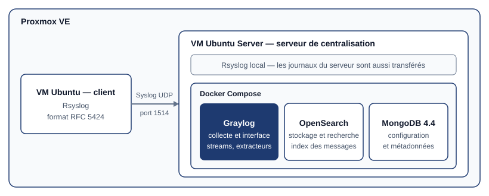

## Contexte

Chaque machine Linux écrit ses journaux d'événements (les *logs*) sur son propre disque. Tant
qu'ils restent dispersés, il faut se connecter à chaque machine pour les lire, et un attaquant qui
prend la main sur un poste peut y effacer ses traces. **Centraliser les journaux** sur un serveur
dédié répond aux deux problèmes : tout se consulte au même endroit, et une copie des événements
existe ailleurs que sur la machine concernée.

J'ai donc déployé une plateforme de centralisation des journaux avec **Graylog**, dans des
machines virtuelles sous **Proxmox VE**.

## Objectifs

- Déployer Graylog et ses dépendances dans des **conteneurs Docker**.
- Faire remonter les journaux de plusieurs machines Linux avec **Rsyslog**.
- Donner un accès de consultation qui respecte le **principe du moindre privilège**.
- Empêcher les journaux de **saturer le disque** du serveur.
- Trier les messages et en extraire des champs exploitables pour la recherche.

## Architecture



| Élément | Rôle |
| --- | --- |
| **Proxmox VE** | Hyperviseur qui héberge les deux machines virtuelles |
| **VM Ubuntu Server — serveur de centralisation** | Héberge la pile Graylog et son propre service Rsyslog |
| **Graylog** | Reçoit les messages, les traite et fournit l'interface web de recherche |
| **OpenSearch** | Moteur de recherche : stocke et indexe les messages |
| **MongoDB** | Base de métadonnées : configuration de Graylog, utilisateurs, streams |
| **VM Ubuntu — client** | Machine distante qui transmet ses journaux système au serveur |

## Incident : MongoDB refuse de démarrer

### Symptôme

Au premier lancement de la pile avec Docker Compose, le conteneur MongoDB s'arrêtait
immédiatement et redémarrait en boucle, avec le **code de sortie 132**. Graylog, qui dépend de
MongoDB, ne pouvait donc pas démarrer non plus.

### Diagnostic

Le code 132 correspond au signal **SIGILL** (*illegal instruction*, 128 + 4) : le programme a
demandé au processeur une instruction qu'il ne connaît pas. Depuis la version 5.0, MongoDB a
besoin du jeu d'instructions **AVX**. Or le processeur du serveur Proxmox ne le possède pas.

### Résolution

1. **Type de processeur de la VM passé sur `host`** dans Proxmox, pour que la machine virtuelle
   voie toutes les instructions du processeur physique et non un modèle générique réduit. Le
   processeur physique n'ayant pas AVX, ce réglage ne suffisait pas à lui seul.
2. **MongoDB verrouillé en version 4.4** dans le fichier `docker-compose.yml`. C'est la dernière
   branche qui fonctionne sans AVX. Fixer la version évite aussi qu'une mise à jour de l'image
   ne ramène le problème.
3. **Ajustement de la configuration de Graylog** pour stabiliser la communication entre les
   conteneurs : adresse d'OpenSearch indiquée explicitement et contrôles de pré-démarrage
   désactivés.
4. **Réinitialisation du mot de passe administrateur** : Graylog ne stocke pas le mot de passe
   en clair mais son empreinte SHA-256, à fournir dans `GRAYLOG_ROOT_PASSWORD_SHA2`.

Extrait du fichier `docker-compose.yml` après correction :

```yaml
services:
  mongodb:
    image: mongo:4.4            # dernière branche utilisable sans AVX

  graylog:
    environment:
      GRAYLOG_ELASTICSEARCH_HOSTS: "http://opensearch:9200"
      GRAYLOG_SKIP_PREFLIGHT_CHECKS: "true"
      GRAYLOG_ROOT_PASSWORD_SHA2: "<empreinte SHA-256 du mot de passe>"
```

## Collecte des journaux

### 1. L'entrée (Input) dans Graylog

| Paramètre | Valeur |
| --- | --- |
| Type | Syslog UDP |
| Port d'écoute | 1514/UDP |
| Adresse d'écoute | `0.0.0.0` (toutes les interfaces) |

Le port standard de Syslog est le 514, mais les ports inférieurs à 1024 sont réservés aux
processus privilégiés. Utiliser le 1514 permet à Graylog d'écouter sans droits d'administrateur.

### 2. Le transfert avec Rsyslog

Sur le serveur lui-même et sur la machine cliente, une règle de transfert est ajoutée dans
`/etc/rsyslog.d/50-graylog.conf` :

```
*.* @<IP_DU_SERVEUR_GRAYLOG>:1514;RSYSLOG_SyslogProtocol23Format
```

- `*.*` : tous les journaux, quels que soient le service et le niveau de gravité ;
- un seul `@` : envoi en **UDP** (deux `@@` signifieraient TCP) ;
- `RSYSLOG_SyslogProtocol23Format` : messages au format normalisé **RFC 5424**, que Graylog
  découpe correctement (date, machine, application, message).

### 3. Validation

La commande `logger` écrit un message de test dans le journal système de la machine :

```bash
logger "Test de remontée vers Graylog"
```

Le message apparaît en temps réel dans la recherche de Graylog, avec le nom de la machine
d'origine : la chaîne complète (journal local → Rsyslog → réseau → Graylog → OpenSearch)
fonctionne.

## Sécurité des accès : un compte en lecture seule

Consulter les journaux ne demande pas les droits d'administration. Pour respecter le **principe
du moindre privilège**, j'ai créé un compte dédié à la supervision :

| Paramètre | Valeur | Pourquoi |
| --- | --- | --- |
| Utilisateur | `observateur` | Compte nominatif, distinct du compte administrateur |
| Rôle | **Reader** (lecture seule) | Pas de gestion des nœuds, ni de modification des inputs, ni de suppression d'index |
| Fuseau horaire | `Europe/Paris` | Les heures affichées correspondent à l'heure locale |

Le fuseau horaire n'est pas un détail : lors d'une investigation, on reconstitue une chronologie.
Un décalage d'une ou deux heures entre ce qu'affiche l'outil et l'heure réelle des faits conduit
à de mauvaises conclusions.

## Disponibilité : maîtriser l'espace disque

Des journaux qui s'accumulent sans limite finissent par remplir le disque de la machine
virtuelle, ce qui arrête le service. La rotation des index (*Index Sets*) borne cet espace :

| Réglage | Valeur |
| --- | --- |
| Rotation | Par taille : un nouvel index tous les **2 Go** (2 147 483 648 octets) |
| Rétention | Suppression de l'index le plus ancien (*Delete Index*) |
| Nombre d'index conservés | **6** au maximum |

L'empreinte disque des journaux est ainsi plafonnée à environ **12 Go** (6 × 2 Go).

## Organisation et exploitation des messages

### Les streams

Un **stream** range les messages dans un flux selon des règles. J'ai créé le flux
**Serveurs Linux**, alimenté par une règle sur le champ `gl2_source_input` : seuls les messages
arrivés par l'entrée Syslog créée plus haut y sont placés.

### Les extracteurs

Un message Syslog brut est une simple ligne de texte. Un **extracteur** en isole une partie pour
la ranger dans un champ à part, sur lequel on peut ensuite filtrer et faire des statistiques.

| Paramètre | Valeur |
| --- | --- |
| Type | Expression régulière (Regex) |
| Champ source | `message` |
| Condition | Le message contient la chaîne `.service` |
| Champ de destination | `extracted_service` |

L'expression capture le nom du service systemd cité dans le message : `packagekit`,
`man-db`… La condition évite d'appliquer l'expression régulière à tous
les messages et **économise le processeur** : elle n'est évaluée que sur ceux qui peuvent
correspondre.

## Résultat

Les journaux du serveur et de la machine cliente arrivent en temps réel dans une interface
unique. Ils sont triés dans un flux dédié, enrichis d'un champ qui indique le service concerné,
consultables par un compte qui ne peut rien modifier, et leur volume sur le disque est plafonné.

## Limites et pistes d'amélioration

- **Syslog en UDP** : les messages circulent en clair et un message perdu n'est pas renvoyé.
  En production, on préférerait Syslog sur **TCP avec TLS**.
- **MongoDB 4.4** n'est plus maintenu par son éditeur, et désactiver les contrôles de
  pré-démarrage masque les avertissements de compatibilité. C'est un contournement acceptable en
  laboratoire, imposé par le matériel ; en production, il faudrait un processeur compatible AVX
  et des versions maintenues.
- Le champ `extracted_service` prépare la suite logique : des **tableaux de bord** par service.

## Bilan

**Ce que j'en retiens :**

- un **code de sortie** se lit : 132 désigne un signal précis, qui oriente directement vers le
  processeur plutôt que vers la configuration ;
- **fixer les versions** des images Docker rend un déploiement reproductible ;
- la sécurité d'un outil de journalisation ne se limite pas à la collecte : **qui peut lire**,
  **qui peut modifier** et **combien de temps on conserve** comptent autant ;
- structurer les messages dès leur arrivée (streams, extracteurs) est ce qui rend les journaux
  réellement exploitables.
