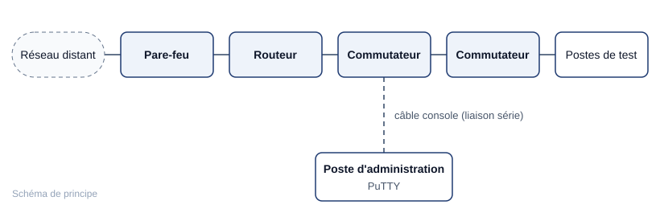

## Contexte

J'ai effectué mon stage de première année de BTS SIO (5 semaines, en mai et juin 2026) au
**Ministère de la Justice**, au sein de la **DIT**, sur le site de Jolimont à Toulouse. Le stage
portait sur l'infrastructure réseau d'un **bâtiment judiciaire** et comportait deux volets :

1. **gestion de projet** : recueillir les besoins, concevoir une proposition d'infrastructure et la présenter à l'oral ;
2. **technique** : valider des configurations sur une maquette physique et résoudre des pannes injectées par mon tuteur.

Le contexte judiciaire impose des exigences particulières : les données traitées par le greffe
et les magistrats sont sensibles, ce qui implique de cloisonner les flux et de rester attentif
à la sécurité.

## Objectifs

- Recenser les besoins des utilisateurs du bâtiment et des équipes techniques.
- Proposer une infrastructure adaptée et la défendre devant un jury.
- Valider le fonctionnement sur maquette et savoir diagnostiquer une panne avec méthode.

## Volet 1 — Recueil des besoins et proposition

### Conduite des entretiens

J'ai mené des **entretiens** avec les différents services du bâtiment et avec les équipes de la
DIT afin de recenser les besoins fonctionnels :

| Population | Besoins recueillis |
| --- | --- |
| **Greffe** | Postes de travail, accès aux applications métier, impression |
| **Magistrats** | Postes de travail, accès aux ressources et aux applications métier |
| **Services administratifs** | Postes bureautiques, accès aux ressources partagées |
| **Équipes de la DIT** | Contraintes techniques, exigences de sécurité, **flux sécurisés** vers les autres sites |

Démarche suivie pour chaque entretien :

1. **préparer** une grille de questions (nombre d'utilisateurs, usages, applications, confidentialité) ;
2. **écouter et reformuler** le besoin dans le vocabulaire de l'interlocuteur, sans imposer de solution ;
3. **consigner** les besoins par service ;
4. **faire valider** la synthèse par l'équipe de la DIT.

### Proposition et soutenance

Les besoins ont été traduits en une proposition d'infrastructure avec un principe directeur :
**séparer les populations et les flux selon leur sensibilité**, et faire passer les échanges
avec l'extérieur du bâtiment par des flux sécurisés conformes aux exigences de la DIT.

J'ai ensuite **présenté et défendu cette proposition à l'oral devant un jury de spécialistes** :
structurer la présentation du besoin à la solution, justifier chaque choix, répondre aux
questions techniques.

## Volet 2 — Maquette physique et résolution de pannes

### La maquette

J'ai travaillé sur une maquette physique composée de **commutateurs**, de **routeurs** et de
**pare-feu**, interconnectée avec un **réseau distant**. Les équipements étaient administrés en
ligne de commande (**syntaxe de type Cisco IOS**) par **câble console et PuTTY**.

### Les pannes injectées

Mon tuteur introduisait volontairement des pannes que je devais identifier puis corriger :

| Type de panne | Couche OSI concernée |
| --- | --- |
| **Erreurs de câblage** (câble mal branché, mauvais port) | 1 — Physique |
| **Boucles** de commutation | 2 — Liaison |
| **Mauvaise encapsulation** (configuration 802.1Q incohérente entre deux équipements) | 2 — Liaison |
| **Droits d'accès** (règle de filtrage bloquant un flux légitime) | 3 et 4 — Réseau, transport |

### Méthode de diagnostic : du bas vers le haut du modèle OSI

On ne vérifie une couche que lorsque les couches inférieures sont validées. Cela évite de
modifier la configuration « au hasard » et permet d'expliquer précisément l'origine de la panne.

| Étape | Ce que je vérifie | Commandes |
| --- | --- | --- |
| **1. Physique** | Câblage, état des ports | Contrôle visuel, `show ip interface brief`, `show interfaces` |
| **2. Liaison** | VLAN, trunks, table MAC, boucles | `show vlan brief`, `show interfaces trunk`, `show spanning-tree`, `show mac address-table` |
| **3. Réseau** | Adressage, routage, table ARP | `ping` de proche en proche, `traceroute`, `show arp`, `show ip route` |
| **4. Filtrage** | Règles d'accès, leur ordre et leur portée | `show running-config` |
| **5. Validation** | La panne est résolue sans en créer d'autre | Nouveau test de bout en bout |

**Réflexes acquis :**

- **tester de proche en proche** : passerelle, puis routeur suivant, puis réseau distant ; le premier échec localise la panne ;
- **lire les tables plutôt que supposer** : la table MAC indique sur quel port un équipement est vu, la table ARP associe adresse IP et adresse MAC ;
- **comparer les deux extrémités d'un lien** : une encapsulation différente de part et d'autre d'un trunk suffit à couper le trafic ;
- **toujours valider après correction**.

## Résultat

- Une proposition d'infrastructure construite à partir des besoins réels, présentée et défendue devant un jury de spécialistes.
- Chaque panne injectée sur la maquette a été traitée en appliquant la méthode de diagnostic par couches.

## Bilan

**Ce que j'ai appris :** une infrastructure se conçoit d'abord à partir des **besoins des
utilisateurs** et se valide par des **tests** ; face à une panne, la **méthode** compte davantage
que la mémorisation des commandes. J'ai aussi appris à travailler dans un environnement où la
confidentialité est une obligation professionnelle.
