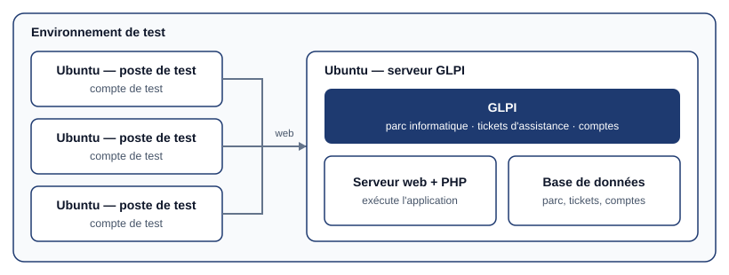

## Contexte

**GLPI** est un logiciel libre français de gestion des services informatiques. Il répond à deux
besoins de tout service informatique : **savoir ce que l'on possède** (inventaire du parc :
ordinateurs, logiciels, matériels réseau) et **suivre les demandes des utilisateurs** (tickets
d'assistance).

J'ai installé et paramétré un serveur GLPI **en partant de zéro** : création de la machine
virtuelle, installation du système, des services nécessaires, de l'application, puis des comptes.
Je l'ai ensuite testé depuis plusieurs machines Ubuntu, avec plusieurs comptes.

## Objectifs

- Créer et préparer une machine **Ubuntu Server** dédiée.
- Installer les services dont GLPI dépend : **serveur web**, **PHP** et **base de données**.
- Installer GLPI et le **paramétrer**.
- Créer **plusieurs comptes** avec des droits différents.
- **Tester** le service depuis plusieurs machines, avec chacun de ces comptes.

## Architecture



| Élément | Rôle |
| --- | --- |
| **Proxmox VE** | Hyperviseur qui héberge les machines virtuelles |
| **VM Ubuntu Server** | Serveur dédié à GLPI |
| **Apache + PHP** | Serveur web qui exécute l'application GLPI |
| **MariaDB** | Base de données : parc, tickets, comptes, configuration |
| **VM Ubuntu de test** | Postes depuis lesquels le service est utilisé et vérifié |

## Réalisation, étape par étape

### 1. La machine virtuelle

Création de la machine virtuelle, installation d'**Ubuntu Server**, puis mise à jour du système.
Le serveur reçoit une **adresse IP fixe** : les postes doivent toujours le trouver à la même
adresse.

```bash
sudo apt update && sudo apt upgrade
```

### 2. Les services dont GLPI dépend

GLPI est une application web écrite en PHP, qui range ses données dans une base de données. Il
lui faut donc trois briques :

```bash
sudo apt install apache2 mariadb-server php
```

S'y ajoutent les **extensions PHP** que GLPI réclame (accès à la base de données, images,
annuaire LDAP, etc.). L'assistant d'installation de GLPI liste celles qui manquent : je les ai
installées jusqu'à ce que tous les contrôles soient validés.

### 3. La base de données

GLPI ne doit pas se connecter à la base de données avec le compte administrateur. J'ai créé une
**base dédiée** et un **utilisateur dédié**, qui n'a de droits que sur cette base :

```sql
CREATE DATABASE glpi;
CREATE USER 'glpi'@'localhost' IDENTIFIED BY '<mot de passe>';
GRANT ALL PRIVILEGES ON glpi.* TO 'glpi'@'localhost';
FLUSH PRIVILEGES;
```

Si l'application était compromise, l'attaquant n'aurait accès qu'à la base de GLPI et non à
l'ensemble du serveur de bases de données.

### 4. L'installation de GLPI

- téléchargement de l'archive de GLPI et extraction dans le dossier du serveur web ;
- attribution des fichiers à l'utilisateur d'Apache (`www-data`), pour que l'application puisse
  écrire ses fichiers de configuration et ses journaux ;
- **assistant d'installation** dans le navigateur : choix de la langue, contrôle des prérequis,
  connexion à la base de données créée à l'étape précédente, initialisation de la base.

### 5. La sécurisation après installation

À la première connexion, GLPI affiche lui-même deux avertissements de sécurité. Je les ai
traités avant d'aller plus loin :

- **changement des mots de passe des comptes par défaut** (`glpi`, `tech`, `normal`,
  `post-only`), dont les mots de passe d'origine sont publics ;
- **suppression du fichier d'installation** (`install/install.php`), pour que personne ne puisse
  relancer l'installation et écraser la base.

### 6. Les comptes et les profils

Dans GLPI, ce qu'un compte peut voir et faire dépend de son **profil**. J'ai créé plusieurs
comptes pour représenter les rôles que l'on rencontre dans une organisation :

| Profil | Ce que le compte peut faire |
| --- | --- |
| **Self-Service** | Utilisateur : créer un ticket et suivre ses propres demandes |
| **Technicien** | Traiter les tickets, consulter et mettre à jour le parc |
| **Super-Admin** | Tout administrer : comptes, profils, configuration |

Chacun n'a que les droits nécessaires à son rôle : c'est le **principe du moindre privilège**.

## Tests

Les tests ont été réalisés depuis **plusieurs machines Ubuntu**, en se connectant à l'interface
web de GLPI avec **chacun des comptes**.

| Vérification | Résultat attendu |
| --- | --- |
| Accès à GLPI depuis chaque machine de test | La page de connexion s'affiche |
| Connexion avec un compte utilisateur | Interface simplifiée : création et suivi de ses tickets uniquement |
| Création d'un ticket par l'utilisateur | Le ticket apparaît dans la file des techniciens |
| Connexion avec un compte technicien | Le ticket peut être pris en charge, suivi puis résolu |
| Retour côté utilisateur | L'utilisateur voit la réponse et l'état de sa demande |
| Cloisonnement des droits | L'utilisateur n'accède ni au parc ni à l'administration |

## Résultat

Un serveur GLPI fonctionnel, installé de bout en bout sur une machine que j'ai créée :
accessible depuis les postes du réseau, sécurisé après installation, avec des comptes dont les
droits correspondent à leur rôle. Le parcours complet d'une demande d'assistance — de sa création
par l'utilisateur à sa résolution par le technicien — a été vérifié.

## Pistes d'amélioration

- **Inventaire automatique** : installer l'agent GLPI sur les postes pour qu'ils remontent
  d'eux-mêmes leur matériel et leurs logiciels.
- **Annuaire** : relier GLPI à un annuaire LDAP / Active Directory pour que les utilisateurs se
  connectent avec leur compte habituel.
- **HTTPS** : chiffrer l'accès à l'interface, sur laquelle circulent des mots de passe.

## Bilan

**Ce que j'en retiens :**

- une application web repose sur une **chaîne de services** (serveur web, PHP, base de données) :
  si un maillon manque, l'application ne démarre pas, et l'assistant d'installation aide à
  trouver lequel ;
- une installation n'est pas terminée quand l'application s'affiche : les **comptes par défaut**
  et les **fichiers d'installation** sont les premières choses à traiter ;
- tester avec **plusieurs comptes** est le seul moyen de vérifier que les droits sont bien
  cloisonnés : avec le seul compte administrateur, tout semble toujours fonctionner.
