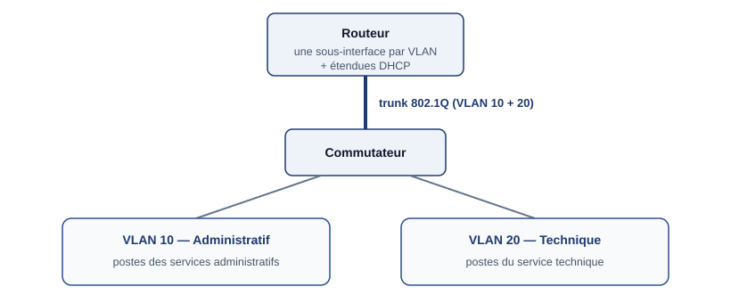

## Contexte

J'utilise **Cisco Packet Tracer** au quotidien pour concevoir et tester un réseau **avant** de le
déployer. Cette fiche présente un cas typique travaillé en formation : séparer les services d'une
organisation en VLAN, les faire communiquer par un routeur et leur attribuer automatiquement
leurs adresses.

## Objectifs

- Séparer deux populations (services administratif et technique) dans des **VLAN** distincts.
- Permettre la communication entre VLAN grâce au **routage inter-VLAN**.
- Distribuer automatiquement les adresses avec le **DHCP**.
- **Valider** le fonctionnement avant tout déploiement réel.

## Architecture



**Pourquoi segmenter ?** Chaque VLAN est un domaine de diffusion séparé : la diffusion est
limitée, et tout échange entre deux services passe obligatoirement par le routeur, où il peut
être contrôlé.

## Réalisation

### 1. VLAN et lien trunk

Sur le commutateur, création des VLAN, affectation des ports d'accès, puis configuration du lien
vers le routeur en **trunk 802.1Q** : ce lien unique transporte les deux VLAN, chaque trame étant
étiquetée avec son numéro de VLAN.

_Les numéros de VLAN et les adresses ci-dessous sont donnés à titre d'illustration._

```cisco
vlan 10
 name ADMINISTRATIF
vlan 20
 name TECHNIQUE
!
interface FastEthernet0/1
 switchport mode access
 switchport access vlan 10
!
interface GigabitEthernet0/1
 switchport mode trunk
```

### 2. Routage inter-VLAN : router-on-a-stick

Sur le routeur, une **sous-interface** par VLAN, chacune avec son encapsulation 802.1Q et son
adresse. Cette adresse sert de passerelle aux postes du VLAN.

```cisco
interface GigabitEthernet0/0
 no shutdown
!
interface GigabitEthernet0/0.10
 encapsulation dot1Q 10
 ip address 192.168.10.254 255.255.255.0
!
interface GigabitEthernet0/0.20
 encapsulation dot1Q 20
 ip address 192.168.20.254 255.255.255.0
```

> **Point de vigilance :** le numéro indiqué dans `encapsulation dot1Q` doit correspondre au VLAN
> transporté par le trunk. Une erreur à cet endroit isole complètement le VLAN — c'est l'un des
> types de panne que j'ai eu à diagnostiquer pendant [mon stage](../deploiement-reseau-nouveau-batiment-justice/).

### 3. DHCP : étendues et exclusions

Une **étendue** par VLAN, et **exclusion** des adresses réservées aux équipements configurés à la
main (passerelles, serveurs) :

```cisco
ip dhcp excluded-address 192.168.10.250 192.168.10.254
ip dhcp excluded-address 192.168.20.250 192.168.20.254
!
ip dhcp pool VLAN10-ADMINISTRATIF
 network 192.168.10.0 255.255.255.0
 default-router 192.168.10.254
!
ip dhcp pool VLAN20-TECHNIQUE
 network 192.168.20.0 255.255.255.0
 default-router 192.168.20.254
```

### 4. Relais DHCP

Une requête DHCP est un **broadcast** : elle ne traverse pas le routeur. Quand le serveur DHCP
se trouve dans un autre réseau que les clients, la commande `ip helper-address` sur la
sous-interface du VLAN **relaie** la requête vers le serveur.

```cisco
interface GigabitEthernet0/0.20
 ip helper-address 192.168.10.250
```

## Vérifications

| Test | Résultat attendu |
| --- | --- |
| Configuration IP d'un poste (`ipconfig`) | Adresse reçue dans l'étendue de son VLAN, bonne passerelle |
| `ping` entre deux postes du même VLAN | Réussite, sans passer par le routeur |
| `ping` entre deux postes de VLAN différents | Réussite, via le routeur |
| `show vlan brief` | Ports affectés au bon VLAN |
| `show interfaces trunk` | VLAN 10 et 20 autorisés sur le trunk |
| `show ip interface brief` (routeur) | Sous-interfaces actives |

## Résultat

Un réseau segmenté, dont les postes reçoivent automatiquement leur configuration et communiquent
entre services via le routeur, validé sur le simulateur avant tout déploiement.

## Bilan

Modéliser d'abord sur Packet Tracer permet de **détecter les erreurs de conception à moindre
coût**. C'est aussi un excellent outil pour comprendre ce qui se passe réellement : le mode
simulation montre le trajet de chaque trame, étiquette VLAN comprise.
