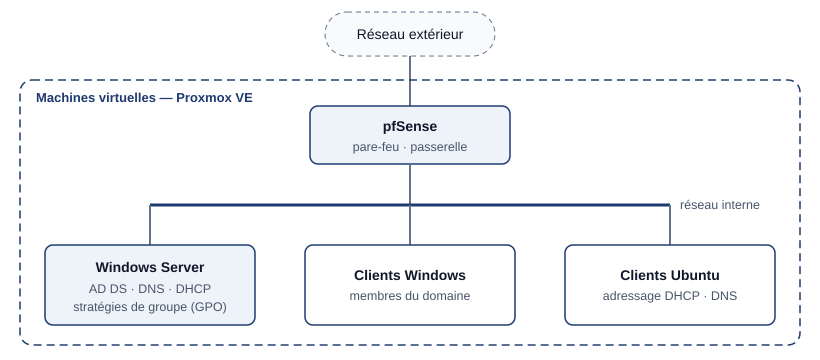

## Contexte

Au cours de ma formation, j'ai construit **un réseau d'organisation complet**, de l'hyperviseur
jusqu'aux postes des utilisateurs. Toutes les machines sont virtualisées sur **Proxmox VE**, que
j'utilise au quotidien. L'objectif est de disposer d'une infrastructure qui fonctionne comme celle
d'une vraie entreprise : un annuaire, des adresses attribuées automatiquement, un pare-feu en
bordure et des sauvegardes.

## Objectifs

- Protéger le réseau interne derrière un **pare-feu**.
- Centraliser les comptes et les ordinateurs dans un **domaine Active Directory**.
- Attribuer automatiquement l'adressage IP avec un **serveur DHCP**.
- Appliquer des règles de sécurité communes à tous les postes grâce aux **stratégies de groupe**.
- Intégrer des postes **Windows** et **Ubuntu** et vérifier qu'ils fonctionnent dans ce réseau.
- Mettre en place des **sauvegardes**.

## Architecture

| Élément | Rôle dans le réseau |
| --- | --- |
| **Proxmox VE** | Hyperviseur qui héberge toutes les machines virtuelles |
| **pfSense** | Pare-feu et passerelle entre le réseau interne et l'extérieur |
| **Windows Server — AD DS** | Annuaire : comptes utilisateurs, groupes, ordinateurs du domaine |
| **Windows Server — DNS** | Résolution des noms du domaine, indispensable à Active Directory |
| **Windows Server — DHCP** | Attribution automatique des adresses IP, de la passerelle et du DNS |
| **Clients Windows** | Postes des utilisateurs, membres du domaine |
| **Clients Ubuntu** | Postes Linux intégrés au même réseau |

## Réalisation, étape par étape

### 1. Les machines virtuelles

Création des machines virtuelles dans Proxmox VE (ressources, disque, carte réseau), puis
installation des systèmes : pfSense, Windows Server, clients Windows et clients Ubuntu.

### 2. Le pare-feu pfSense

pfSense est placé en bordure du réseau : c'est la **passerelle** des machines internes vers
l'extérieur et le point où le trafic est **filtré**. Toute communication entre le réseau interne
et l'extérieur passe par lui.

### 3. Le contrôleur de domaine

Sur Windows Server :

- installation du rôle **AD DS** et promotion du serveur en **contrôleur de domaine** ;
- **DNS** installé avec Active Directory : les postes trouvent le contrôleur de domaine grâce aux enregistrements DNS du domaine ;
- organisation de l'annuaire en unités d'organisation, utilisateurs et groupes.

Le serveur a une **adresse IP fixe** : un serveur d'annuaire, DNS et DHCP ne doit pas dépendre
d'une attribution automatique.

### 4. Le serveur DHCP

Le rôle DHCP distribue automatiquement aux postes : une **adresse IP** prise dans une étendue, la
**passerelle** (pfSense) et le **serveur DNS** du domaine. Les adresses des serveurs, configurées
manuellement, sont exclues de la distribution.

### 5. Les stratégies de groupe (GPO)

Les GPO appliquent de façon centralisée des paramètres de **sécurité des sessions** à tous les
postes d'une unité d'organisation, au lieu de configurer chaque machine à la main. Démarche :
créer la GPO, la lier à l'unité d'organisation, forcer l'application sur un poste
(`gpupdate /force`) et vérifier le résultat (`gpresult /r`).

### 6. Les postes clients

- Les **postes Windows** sont joints au domaine : les utilisateurs ouvrent leur session avec leur compte Active Directory.
- Les **postes Ubuntu** reçoivent leur adresse par le DHCP et utilisent le DNS du domaine.

### 7. Les sauvegardes

Des **sauvegardes** ont été mises en place pour pouvoir remettre l'infrastructure en service en
cas de panne, d'erreur de manipulation ou d'attaque. Sans sauvegarde, la perte d'un seul serveur
(annuaire, DHCP) paralyserait tout le réseau.

## Vérifications

| Vérification | Poste Windows | Poste Ubuntu |
| --- | --- | --- |
| Adresse, passerelle et DNS reçus du DHCP | `ipconfig /all` | `ip address`, `ip route`, `resolvectl status` |
| Résolution des noms du domaine | `nslookup` | `nslookup` |
| Accès vers l'extérieur via pfSense | `ping`, navigation | `ping` |
| Application des stratégies de groupe | `gpresult /r` | — |

## Résultat

Un réseau d'entreprise fonctionnel de bout en bout : les postes Windows et Ubuntu obtiennent
automatiquement leur configuration réseau, les utilisateurs se connectent avec leur compte du
domaine, les règles de sécurité des sessions s'appliquent automatiquement, le réseau interne est
protégé par pfSense et l'infrastructure est sauvegardée.

## Bilan

**Ce que j'en retiens :**

- le **DNS** est la pièce centrale d'un domaine Active Directory : la plupart des problèmes côté client s'expliquent par une mauvaise configuration DNS ;
- chaque service dépend d'un autre (DHCP → DNS → annuaire) : l'ordre d'installation compte ;
- une infrastructure n'est complète qu'avec ses **sauvegardes**.
