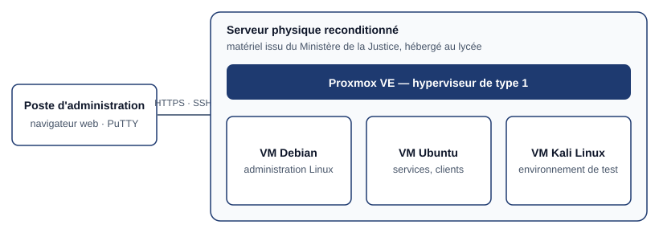

## Contexte

Le serveur sur lequel je travaille au quotidien est un **ancien serveur du Ministère de la
Justice**, réformé puis réaffecté au lycée, où il est hébergé. Ses disques avaient été effacés
(formatés) avant ce réemploi. Il fallait donc le **remettre en état de fonctionner**, puis y
installer un hyperviseur pour héberger les machines virtuelles des travaux pratiques.

Donner une seconde vie à du matériel professionnel plutôt que d'en acheter du neuf, c'est aussi
une façon de **gérer le patrimoine informatique** de manière économe et responsable.

## Objectifs

- Rendre le serveur opérationnel sur le plan matériel.
- Installer et configurer **Proxmox VE**.
- Créer les machines virtuelles nécessaires aux travaux pratiques.

## Architecture

## Réalisation

### 1. Préparation matérielle

J'ai réalisé moi-même la préparation physique du serveur :

- **installation des barrettes de mémoire vive** dans les emplacements prévus ;
- **installation et raccordement des disques durs** (fixation, câbles de données et d'alimentation) ;
- vérification au démarrage que la mémoire et les disques sont bien détectés ;
- activation des **extensions de virtualisation** du processeur, indispensables à un hyperviseur.

**Précautions :** machine hors tension et débranchée, décharge de l'électricité statique avant de
manipuler les composants, respect des détrompeurs.

### 2. Installation de Proxmox VE

1. téléchargement de l'image ISO officielle et création d'une clé USB d'installation ;
2. démarrage du serveur sur la clé ;
3. choix du disque système ;
4. paramètres régionaux, mot de passe administrateur, adresse e-mail de notification ;
5. configuration réseau de l'interface d'administration : nom d'hôte, **adresse IP fixe**, passerelle, DNS ;
6. redémarrage puis accès à l'**interface web d'administration** depuis un autre poste (HTTPS, port 8006) ;
7. mise à jour du système.

**Pourquoi une adresse IP fixe ?** L'hyperviseur est administré à distance : son adresse ne doit
pas changer.

### 3. Machines virtuelles

| Machine virtuelle | Usage |
| --- | --- |
| **Debian** | Administration Linux en mode serveur |
| **Ubuntu** | Services et postes clients |
| **Kali Linux** | Environnement de test pour la pratique de la sécurité |

Même démarche pour chacune : téléverser l'ISO dans le stockage de Proxmox, créer la VM
(processeurs, mémoire, disque, carte réseau), démarrer sur l'ISO, installer le système.

> Les outils d'audit de Kali Linux ne sont utilisés que sur mes propres machines ou sur des
> plateformes d'entraînement prévues pour cela, comme [Root-Me](../root-me-analyse-protocoles-en-clair/).

### 4. VirtualBox en complément

Sur mon ordinateur personnel, **VirtualBox** me sert pour les tests rapides. Ses différents modes
réseau (NAT, réseau interne, accès par pont) m'ont aidé à comprendre concrètement l'isolement et
l'adressage.

| | Proxmox VE | VirtualBox |
| --- | --- | --- |
| Type | Hyperviseur de type 1, installé directement sur le matériel | Hyperviseur de type 2, logiciel sur un système existant |
| Où | Serveur du lycée | Mon ordinateur personnel |
| Usage | Machines durables, administrées à distance | Tests ponctuels |

## Résultat

Un serveur réformé remis en service, qui héberge au quotidien les machines virtuelles de mes
travaux pratiques — dont le [réseau d'entreprise complet](../reseau-entreprise-proxmox-ad-pfsense/).

## Bilan

Cette réalisation m'a donné une vision **du composant matériel jusqu'au service**, que l'on n'a
pas lorsqu'on travaille uniquement sur des machines déjà préparées.
