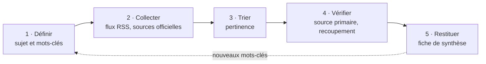

## Pourquoi une démarche de veille ?

La veille technologique fait partie des compétences évaluées au BTS SIO (« Organiser son
développement professionnel ») : un technicien doit être capable de **se tenir informé de
manière organisée**, de **vérifier** ce qu'il lit et de **restituer** une synthèse argumentée.

Ma veille porte sur l'**architecture Zero Trust** et son lien avec la **directive NIS 2**. Ce
sujet relie directement ma formation SISR (réseaux, segmentation, administration) à mon projet de
poursuite d'études en cybersécurité.

## La démarche en cinq étapes

### 1. Définir le sujet et les mots-clés

Un sujet trop large rend la veille ingérable. J'ai donc délimité le mien par une problématique
(le passage du modèle périmétrique au Zero Trust dans les entreprises et les administrations) et
par une liste de mots-clés : _Zero Trust_, _ZTA_, _ZTNA_, _micro-segmentation_, _NIST SP 800-207_,
_NIS 2_.

### 2. Collecter : sources et outils

**Sources institutionnelles**, prioritaires car fiables et en français :

| Source | Contenu utile |
| --- | --- |
| **ANSSI** (`cyber.gouv.fr`) | Guides, avis (dont l'avis sur le modèle Zero Trust), actualités liées à NIS 2 |
| **CERT-FR** (`cert.ssi.gouv.fr`) | Alertes de sécurité, avis sur les vulnérabilités, bulletins d'actualité |

**Sources complémentaires :**

- **The Hacker News** : actualité internationale de la cybersécurité ;
- publications de référence comme le **NIST** (SP 800-207) et les textes officiels européens (**EUR-Lex** pour NIS 2) ;
- comptes d'experts en sécurité suivis sur **Mastodon** et **Bluesky**, utiles pour repérer tôt un sujet.

**Outil d'agrégation : les flux RSS dans Inoreader.** Plutôt que de consulter chaque site un par
un, je m'abonne à leurs **flux RSS** : les nouvelles publications arrivent automatiquement dans un
agrégateur unique, **Inoreader**, où je les classe en dossiers (sources institutionnelles, presse,
Zero Trust).

### 3. Trier

À chaque consultation, je parcours les titres et ne conserve que les articles en lien avec mes
mots-clés ou avec les technologies que j'utilise. Les autres sont écartés sans lecture complète.

### 4. Vérifier la fiabilité

Avant d'utiliser une information, je contrôle :

- **l'origine** : je remonte jusqu'à la source primaire (texte officiel, publication de l'ANSSI, du NIST, bulletin d'un éditeur) ;
- **le recoupement** : une information issue de la presse ou des réseaux sociaux doit être confirmée par une seconde source indépendante ;
- **la date** : une information ancienne peut ne plus être d'actualité (c'est notamment le cas de l'état de transposition de NIS 2).

### 5. Restituer

La veille aboutit à une **fiche de synthèse** — la [fiche Zero Trust / NIS 2](../zero-trust-architecture-synthese/) —
qui explique le sujet, compare les approches, cite ses sources et propose une analyse personnelle.
Elle est mise à jour lorsque de nouvelles informations significatives sont publiées ; la date de
dernière mise à jour y est indiquée.

## Ce que m'apporte cette démarche

- une méthode réutilisable pour **se former en continu**, indispensable dans le domaine de la cybersécurité ;
- l'habitude de **privilégier les sources officielles** (ANSSI, CERT-FR) et de vérifier avant de relayer une information ;
- une meilleure compréhension des enjeux réglementaires (NIS 2) qui concernent les organisations pour lesquelles je souhaite travailler.
