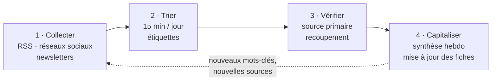

## Objectifs de ma veille

1. **Technologique** : suivre l'évolution du Zero Trust, des architectures réseau et des outils d'administration.
2. **Sécurité opérationnelle** : connaître les vulnérabilités critiques touchant les équipements et logiciels que j'administre (Cisco IOS, Proxmox, Debian, OpenSSH).
3. **Réglementaire** : suivre la transposition et l'application de NIS 2, les publications de l'ANSSI.

## Le processus en quatre étapes

## 1. Collecter : les sources

### Sources institutionnelles (fiabilité maximale)

| Source | Contenu | Accès |
| --- | --- | --- |
| **CERT-FR** | Alertes (vulnérabilités exploitées), avis de sécurité, bulletins d'actualité hebdomadaires | Flux RSS `cert.ssi.gouv.fr/feed/` et flux dédiés alertes / avis |
| **ANSSI** | Guides (durcissement, administration sécurisée), avis (Zero Trust), actualités NIS 2 | Flux RSS des actualités et publications de `cyber.gouv.fr` |
| **NIST / CISA** | Publications de référence (SP 800-207), catalogue des vulnérabilités exploitées (KEV) | RSS + consultation mensuelle |
| **EUR-Lex / Légifrance** | Textes officiels (NIS 2, transposition) | Alertes ciblées |

### Presse et blogs spécialisés

- **The Hacker News** : actualité internationale des menaces, rapide mais à recouper.
- **Le Monde Informatique**, **LeMagIT** : contexte français, retours d'expérience d'entreprises.
- **Blogs d'éditeurs** (Cisco Talos, Proxmox, Debian Security Announcements) : informations de première main sur leurs produits.

### Réseaux sociaux : experts et communautés

- **Mastodon** : une liste privée « Sécurité » regroupant des chercheurs, des CERT et des administrateurs, principalement sur l'instance `infosec.exchange`. Les listes permettent une lecture chronologique, sans algorithme de recommandation.
- **Bluesky** : un fil personnalisé (_custom feed_) filtrant les publications de comptes spécialisés en cybersécurité, et des « starter packs » communautaires pour découvrir de nouveaux comptes.

Les réseaux sociaux servent à **détecter tôt** un sujet ; ils ne sont jamais une source
suffisante à eux seuls.

## 2. Trier : Inoreader comme agrégateur central

Tous les flux RSS convergent dans **Inoreader**, organisé en dossiers :

| Dossier | Flux | Fréquence de lecture |
| --- | --- | --- |
| `01-Alertes` | CERT-FR alertes, CISA KEV | Chaque jour, en priorité |
| `02-Institutionnel` | ANSSI, CERT-FR avis et bulletins, NIST | Chaque jour |
| `03-Zero-Trust` | Recherche par mots-clés « Zero Trust », « ZTNA », « micro-segmentation » | Deux fois par semaine |
| `04-Presse` | The Hacker News, presse française | Deux fois par semaine |
| `05-Éditeurs` | Cisco, Proxmox, Debian Security | Chaque semaine |

**Règles automatiques** utilisées :

- mise en évidence de tout article contenant `Cisco IOS`, `Proxmox`, `OpenSSH`, `Debian` (les technologies que j'administre) ;
- étiquette `NIS2` sur tout article mentionnant « NIS 2 » ou « NIS2 » ;
- archivage automatique des articles non lus après 30 jours (éviter la dette de lecture).

Chaque jour, **15 minutes** en début de journée : lecture des titres, marquage « à lire » ou
archivage. Les articles retenus reçoivent une étiquette thématique.

## 3. Vérifier : fiabilité des informations

Avant d'intégrer une information à ma veille, j'applique une grille simple :

- **Source primaire** : je remonte jusqu'au texte officiel, au bulletin de l'éditeur ou à la publication d'origine.
- **Recoupement** : au moins deux sources indépendantes pour une information non institutionnelle.
- **Date** : une vulnérabilité « critique » d'il y a trois ans n'a pas le même intérêt qu'une alerte de la veille.
- **Intérêt** : l'information concerne-t-elle mon sujet ou les technologies que j'utilise ?

## 4. Capitaliser : transformer la lecture en connaissance

- **Synthèse hebdomadaire** (le dimanche, 30 minutes) : cinq à dix faits marquants, chacun résumé en deux lignes avec sa source, dans un fichier Markdown versionné sous Git.
- **Mise à jour trimestrielle** de la [fiche de synthèse Zero Trust](../zero-trust-architecture-synthese/) (la date de dernière mise à jour y est indiquée).
- **Mise en pratique** : lorsqu'un avis concerne une technologie de mon homelab (par exemple une vulnérabilité OpenSSH), j'applique le correctif et je note la procédure.

## Bilan de la démarche

| Indicateur | Valeur |
| --- | --- |
| Flux RSS suivis | 18 |
| Temps consacré | ~2 h par semaine |
| Synthèses hebdomadaires rédigées | depuis octobre 2025 |
| Actions concrètes issues de la veille | mises à jour de sécurité du homelab, évolution de la fiche Zero Trust au fil de la transposition de NIS 2 |

**Limites identifiées et améliorations prévues :** la presse anglophone domine mes sources ;
j'ajoute progressivement des sources françaises et européennes (ENISA). J'envisage aussi
d'automatiser l'extraction des alertes CERT-FR concernant mes technologies via un petit
script Python qui lit le flux RSS et m'envoie un résumé.
