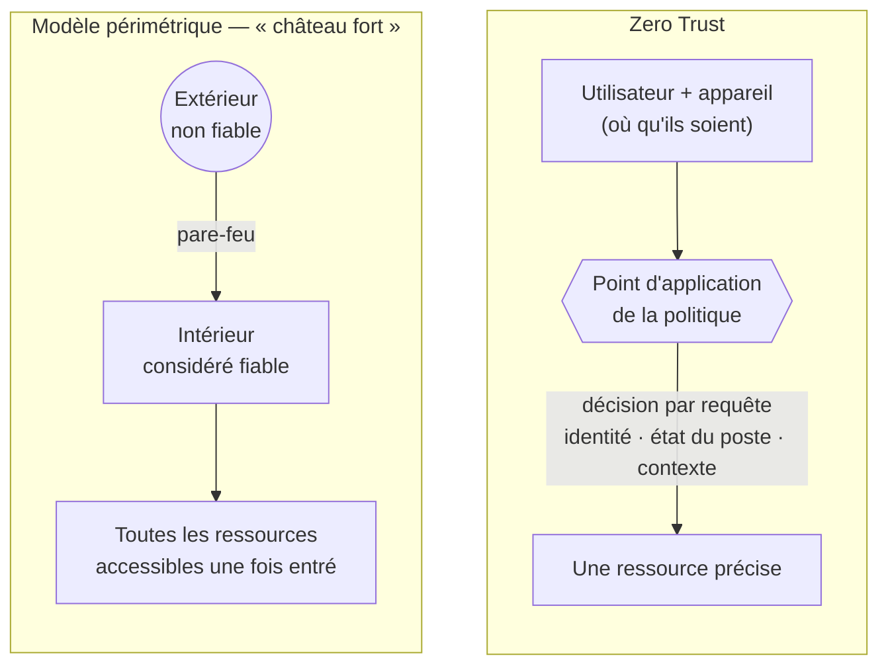

## Pourquoi ce sujet de veille ?

Pendant mon [stage au Ministère de la Justice](../../projets/deploiement-reseau-nouveau-batiment-justice/),
j'ai mis en œuvre une segmentation classique : des VLAN, un pare-feu, un tunnel vers le site
central. Ce modèle repose sur une hypothèse implicite : **ce qui est à l'intérieur est
digne de confiance**. Or les incidents majeurs des dernières années (rançongiciels dans des
hôpitaux et des collectivités, compromissions d'identités) montrent qu'un attaquant, une
fois entré, se déplace latéralement sans rencontrer de résistance.

Le **Zero Trust** propose de supprimer cette confiance implicite. C'est le modèle vers
lequel évoluent les administrations et les entreprises, et la directive **NIS 2** accélère
ce mouvement.

## Du modèle périmétrique au Zero Trust

| Critère | Modèle périmétrique | Zero Trust |
| --- | --- | --- |
| Hypothèse de départ | Le réseau interne est sûr | Le réseau est **toujours** considéré comme hostile |
| Critère d'accès | Emplacement réseau (adresse IP, VLAN) | **Identité** de l'utilisateur et de l'appareil, contexte |
| Moment du contrôle | À l'entrée (connexion VPN, pare-feu) | À **chaque requête**, en continu |
| Granularité | Accès à un réseau entier | Accès à **une ressource** précise |
| Mouvement latéral | Facile une fois à l'intérieur | Bloqué par la micro-segmentation |
| Chiffrement | Surtout en périphérie (VPN) | **De bout en bout**, y compris en interne |
| Télétravail, cloud | Mal adaptés (VPN saturés, trafic en « épingle ») | Natifs : l'emplacement n'a plus d'importance |

## Définition : NIST SP 800-207

Le NIST (organisme de normalisation américain) a publié en 2020 la référence du domaine,
la **SP 800-207**. Elle définit le Zero Trust comme un ensemble de principes visant à
**réduire l'incertitude** sur la légitimité de chaque accès, en considérant qu'aucune
confiance n'est accordée sur la seule base de l'emplacement réseau.

### Les sept principes (_tenets_)

1. Toutes les sources de données et tous les services informatiques sont des **ressources**.
2. **Toutes les communications sont sécurisées**, quel que soit l'emplacement réseau.
3. L'accès est accordé **par session** et pour **une seule ressource**.
4. L'accès est déterminé par une **politique dynamique** (identité, état de l'appareil, comportement, contexte).
5. L'organisation **surveille et mesure l'intégrité** et la posture de sécurité de tous ses actifs.
6. L'authentification et l'autorisation sont **dynamiques et strictement appliquées** avant tout accès.
7. L'organisation **collecte le maximum d'informations** sur l'état de ses actifs et de son réseau pour améliorer sa posture.

### Les composants logiques

- **PE — Policy Engine** : le « cerveau » qui décide d'accorder ou non l'accès, à partir de l'annuaire, de l'état des postes, des journaux et du renseignement sur la menace.
- **PA — Policy Administrator** : exécute la décision (ouvre ou ferme la session, délivre un jeton).
- **PEP — Policy Enforcement Point** : le point de passage obligatoire devant la ressource (proxy applicatif, passerelle, pare-feu de nouvelle génération).

Le NIST décrit trois approches de déploiement, souvent combinées : la **gouvernance des
identités renforcée**, la **micro-segmentation** et le **périmètre défini par logiciel**
(SDP).

## Les piliers du Zero Trust

### 1. Identité : la nouvelle frontière

L'identité remplace l'adresse IP comme critère principal :

- **authentification multifacteur (MFA)** résistante à l'hameçonnage (clés FIDO2, cartes à puce — comme la carte agent dans l'administration) ;
- **moindre privilège** et comptes d'administration séparés des comptes bureautiques ;
- évaluation de l'**appareil** : un utilisateur légitime sur un poste non à jour n'obtient pas le même accès.

### 2. Micro-segmentation

Là où un VLAN regroupe des dizaines de machines, la micro-segmentation isole **chaque
charge de travail** : deux serveurs du même sous-réseau ne peuvent communiquer que si une
règle l'autorise explicitement. Les outils : pare-feu distribués sur les hyperviseurs (comme
le pare-feu Proxmox que j'utilise dans mon [homelab](../../homelab/hyperviseur-proxmox-virtualbox/)),
groupes de sécurité cloud, agents sur les hôtes.

**Lien avec mon parcours :** la règle de refus par défaut entre les VLAN greffe et
administration de mon stage est une **première étape** vers la micro-segmentation — elle
limite le mouvement latéral, mais à l'échelle d'un service entier, pas d'une machine.

### 3. Chiffrement de bout en bout

Si le réseau interne est considéré hostile, tout flux doit être chiffré et authentifié,
**y compris entre deux serveurs du même datacenter** : TLS 1.3 et, idéalement, TLS mutuel
(mTLS) entre services, SSH à la place de TELNET, SNMPv3, Syslog sur TLS. Mon
[write-up Wireshark](../../writeups/root-me-wireshark-pcap-identifiants/) montre concrètement ce
qu'un attaquant lit lorsque ce principe n'est pas respecté.

### 4. Visibilité et analyse continues

Le Zero Trust est **dynamique** : la décision d'accès se nourrit des journaux. Centralisation
(SIEM), détection d'anomalies (connexion à 3 h du matin depuis un pays inhabituel), puis
révocation automatique. C'est précisément le travail d'un **analyste SOC**.

Le modèle de maturité de la CISA reprend ces idées en cinq piliers — **identité, appareils,
réseaux, applications et charges de travail, données** — traversés par trois capacités
transverses : visibilité et analyse, automatisation et orchestration, gouvernance.

## Position de l'ANSSI

Dans son avis de 2021, l'ANSSI reconnaît l'intérêt du modèle, mais insiste sur trois
points que je trouve essentiels :

- le Zero Trust **ne remplace pas** la défense en profondeur ni le cloisonnement : il les **complète** ;
- une migration est un projet **progressif et long**, qui commence par la maîtrise de son système d'information (cartographie, annuaire sain, gestion des identités) ;
- il faut se méfier des offres commerciales qui présentent le Zero Trust comme un **produit** clé en main : c'est une **démarche**.

## Impact de la directive NIS 2

### Ce qui change

La directive (UE) 2022/2555, dite **NIS 2**, élargit fortement le périmètre de la
cybersécurité réglementée. Elle devait être transposée par les États membres au plus tard
le 17 octobre 2024 ; en France, la transposition est portée par le projet de loi dit
« Résilience » et l'ANSSI accompagne les entités concernées via la plateforme
MonEspaceNIS2.

- On passe de quelques centaines d'opérateurs régulés à **plusieurs milliers d'entités** en France, réparties en **entités essentielles** et **entités importantes**, dont de nombreuses **administrations** et collectivités.
- Les **dirigeants** sont personnellement responsables de l'approbation et du suivi des mesures.
- Les **incidents significatifs** doivent être signalés : alerte précoce sous 24 h, notification sous 72 h, rapport final sous un mois.
- Les sanctions peuvent atteindre **10 M€ ou 2 % du chiffre d'affaires mondial** pour les entités essentielles.

### Pourquoi NIS 2 pousse vers le Zero Trust

L'article 21 de la directive impose des mesures de gestion des risques qui recoupent
directement les piliers du Zero Trust :

| Exigence de l'article 21 de NIS 2 | Pilier Zero Trust correspondant |
| --- | --- |
| Politiques de contrôle d'accès et gestion des actifs | Identité, inventaire des appareils |
| Authentification multifacteur, communications sécurisées | Identité, chiffrement |
| Politiques d'utilisation de la cryptographie et du chiffrement | Chiffrement de bout en bout |
| Gestion des incidents, évaluation de l'efficacité des mesures | Visibilité et analyse continues |
| Sécurité de la chaîne d'approvisionnement | Aucune confiance implicite envers les tiers et prestataires |
| Hygiène informatique de base et formation | Socle préalable à toute démarche Zero Trust |

NIS 2 n'impose pas le mot « Zero Trust », mais une organisation qui s'y conforme sérieusement
en adopte de fait les principes.

## Analyse personnelle : ce que cela change pour un administrateur SISR

- **Les compétences réseau restent centrales**, mais elles se déplacent : on segmente moins par VLAN et davantage par identité et par application.
- **L'annuaire (Active Directory, Entra ID) devient l'actif le plus critique** : sa sécurisation (tiering, comptes à privilèges) est un prérequis.
- **La journalisation n'est plus optionnelle** : sans journaux centralisés et horodatés, pas de décision dynamique ni de notification NIS 2 sous 24 h.
- **Une transition réaliste est progressive** : MFA partout → inventaire et conformité des postes → micro-segmentation des serveurs critiques → accès applicatifs (ZTNA) en remplacement du VPN.

## Conclusion

Le Zero Trust n'est pas la fin du pare-feu ni des VLAN : c'est la fin de la **confiance
implicite** qu'on leur accordait. Pour une administration comme pour une entreprise, NIS 2
transforme cette bonne pratique en obligation de moyens. Pour moi, futur analyste SOC ou
administrateur réseau sécurisé, c'est l'assurance que les compétences d'identité, de
segmentation, de chiffrement et de journalisation seront au cœur des métiers de demain.
